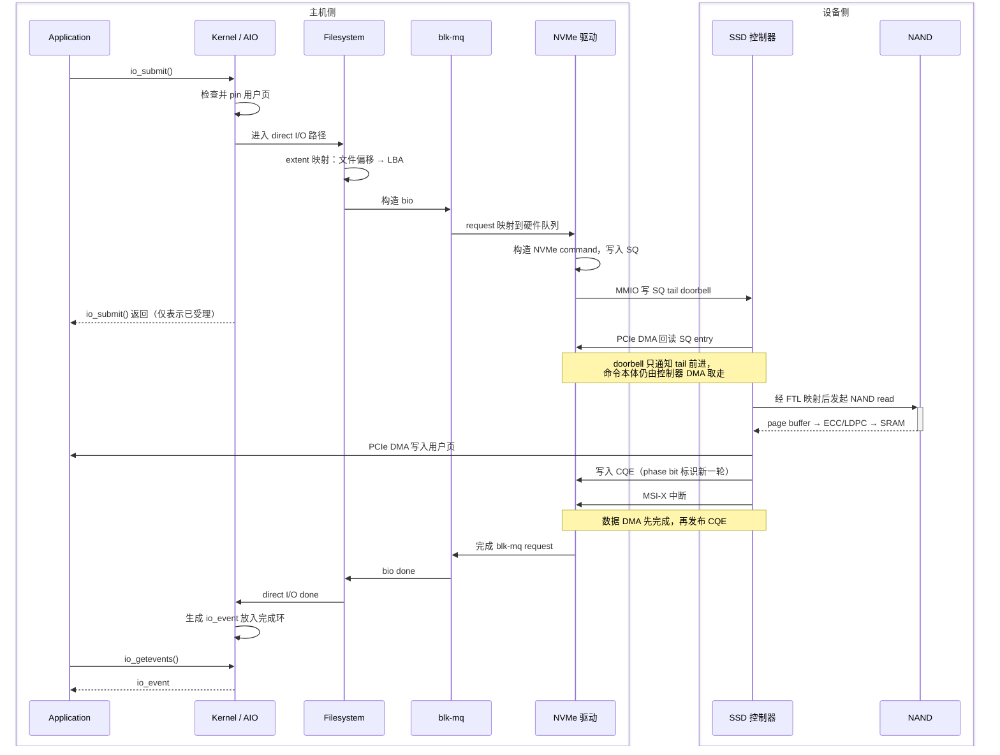

# 一次 AIO 请求的全链路

这篇讲机制：一个 I/O 从用户态的 `iocb` 出发，怎么走到 NAND cell 再走回来。关心"这块盘还能压榨多少"的能力视角，见 [SSD 的能力边界与压榨路径](/hardware/ssd)。

`io_submit()` 通常指 Linux Native AIO（libaio/KAIO），不是 `io_uring`。以下先按最典型、最能体现 SSD 硬件链路的路径讲：

> NVMe SSD + 块设备上的普通文件 + `O_DIRECT` + `IOCB_CMD_PREAD/PWRITE`

这是 Native AIO 的主战场。若不使用 `O_DIRECT`，可能经过 page cache，甚至因文件系统路径发生同步阻塞，流程会明显不同。

## 一句话全流程

```text
用户构造 iocb
  → io_submit()
  → 内核 AIO 层解析请求
  → 锁定并映射用户页
  → 文件系统把文件偏移映射成磁盘 LBA
  → block layer 构造并可能合并 bio/request
  → NVMe 驱动选择提交队列
  → 写入 NVMe SQ，敲 doorbell
  → SSD 控制器通过 PCIe DMA 取命令和数据
  → FTL 完成逻辑地址到 NAND 物理地址映射
  → NAND flash 执行读/编程
  → SSD 写入 CQE，触发 MSI-X
  → CPU 处理中断并回收 request
  → 文件系统/DIO/AIO 完成回调
  → 生成 io_event，唤醒 io_getevents()
```

---

# 第一部分 · 提交侧

## 1. 用户态准备：`io_setup()`、`iocb` 与 `io_submit()`

应用首先创建一个 AIO context：

```c
io_context_t ctx = 0;
io_setup(queue_depth, &ctx);
```

第一个参数严格说是 `nr_events`，即完成环的容量，而不是"能同时在途多少请求"这个语义。在途请求超出这个容量时，`io_submit()` 会返回 `EAGAIN`。通俗上把它当队列深度用没问题，但被追问时要能说清区别。

随后准备 `iocb`：

```c
struct iocb cb;
io_prep_pread(&cb, fd, buf, len, offset);

struct iocb *list[] = { &cb };
io_submit(ctx, 1, list);
```

`iocb` 中最重要的信息是文件描述符 `fd`、用户缓冲区地址 `buf`、长度 `len`、文件偏移 `offset`、操作类型（读或写）、用户自定义标识 `data`。

`io_submit()` 返回成功，只表示内核接受了请求，不表示 SSD 已经完成 I/O。

批量提交时，`io_submit(ctx, nr, iocbpp)` 一次跨越用户态/内核态，提交多个请求，因此可以摊薄 syscall 开销、参数验证、AIO context 查找、调度和唤醒成本。

但 Native AIO 的提交仍然是 syscall；它不像 `io_uring` 那样直接通过共享 SQ 描述符交互。

## 2. 进入内核：系统调用与 AIO 请求对象 {#submit-blocking}

CPU 执行系统调用指令，从用户态进入内核态。内核大致做这些事情：

1. 根据 AIO context ID 找到当前进程的 AIO context。
2. 从用户地址复制 `iocb`。
3. 检查操作类型、文件描述符、长度、偏移和权限。
4. 为请求建立内核态 AIO 对象。
5. 找到 `fd` 对应的 `struct file`。
6. 调用文件的异步读写入口。

不同内核版本中的具体函数名会变化。概念上可以描述为：

```text
io_submit syscall
  → KAIO request
  → VFS async read/write
  → filesystem/direct-I/O path
```

一个关键问题是：提交路径会不会阻塞？

答案是：**可能会。**

即使接口叫异步 I/O，提交过程中仍可能因为以下原因阻塞：

- 缺页，需要建立用户页映射
- 内存回收
- 文件系统元数据读取或锁竞争
- extent 分配
- journal 空间不足
- request/bio 内存分配
- 块层拥塞
- 某些文件系统不支持相应异步路径

因此 Linux AIO 的"异步"主要保证完成通知模型，并不严格保证 `io_submit()` 永远立即返回。这也是 `io_uring` 存在的主要理由之一：它把可能阻塞的操作 punt 给内核工作线程，而不是让提交线程原地等。

## 3. `O_DIRECT`：为什么它对 Native AIO 很重要？ {#o-direct}

使用 `O_DIRECT` 后，数据原则上绕过 page cache：

```text
SSD ←DMA→ 用户缓冲区
```

而非：

```text
SSD ←DMA→ page cache ←CPU copy→ 用户缓冲区
```

它的价值包括避免 page cache 到用户缓冲区的二次复制、避免 page cache 污染、应用可以自行管理缓存、更容易形成真正的异步块 I/O。

但"绕过 page cache"并不表示绕过文件系统、block layer、NVMe 驱动、SSD 内部 DRAM/SRAM、SSD 的 FTL 映射和写缓存。

`O_DIRECT` 还通常有对齐要求：文件偏移对齐、I/O 长度对齐、缓冲区地址对齐。精确要求取决于文件系统、块设备逻辑块大小和内核版本。常见应用会使用 4 KiB 对齐，但不能把"所有 direct I/O 都必须 4 KiB 对齐"说成绝对规则。

这个对齐要求不是内核的洁癖，它在硬件侧有直接来源，见第 7 节的 PRP 格式约束。

## 4. 用户缓冲区如何交给设备：pin page 与 scatter-gather {#pin-page-iova}

SSD 不能直接理解进程的用户虚拟地址。比如：

```text
buf = 0x7f12...
```

这个地址只在当前进程页表上下文中有意义。

内核需要检查用户地址范围是否有效，处理尚未建立映射的页面，将涉及的用户页暂时 pin 住（避免 I/O 期间被回收或迁移），建立描述这些页面的内存向量，最终转换成设备能够执行 DMA 的地址描述。

用户缓冲区在虚拟地址上连续，不代表在物理内存中连续：

```text
用户虚拟地址：
[page 0][page 1][page 2][page 3]

物理页：
PFN 81   PFN 9302   PFN 117   PFN 6001
```

所以块层和驱动使用 scatter-gather 描述符表示多个离散内存段。

如果系统启用了 IOMMU，驱动通过 DMA API 得到的是 I/O virtual address，即 IOVA，而不一定是裸物理地址：

```text
设备 DMA 地址 IOVA
      ↓ IOMMU 翻译
主机物理地址 HPA
      ↓
DRAM
```

IOMMU 的意义包括隔离设备可访问的内存范围、支持地址重映射、让离散物理页形成更方便的设备地址空间、支持虚拟化。代价是每次 DMA mapping 都要建立和拆除 IOVA 映射，高 IOPS 下这部分 CPU 开销可观。

DMA mapping 还可能做 segment 合并，以减少 NVMe 命令需要描述的内存段数量。

---

# 第二部分 · 从文件偏移到 NVMe 命令

## 5. 文件系统：文件偏移如何变成 SSD LBA？ {#fs-mapping}

应用给的是文件偏移 `offset = 128 MiB`，NVMe SSD 需要的是 namespace 中的逻辑块地址 SLBA。文件系统负责把文件逻辑偏移映射到块设备逻辑地址。例如 extent 文件系统可能维护：

```text
文件逻辑块 32768～33023
    → 设备逻辑块 918273～918528
```

读请求通常只需查 extent 映射。写请求更复杂：目标范围已有物理 extent 时可直接覆盖；文件扩展或稀疏区需要分配块；delayed allocation 的文件系统在 direct I/O 路径需特殊处理；copy-on-write 文件系统的覆盖写可能变成分配新 extent；还可能涉及 inode 大小、时间戳和元数据更新，以及与 journal、日志或 ordered-data 语义的交互。

所以"NVMe 很快，但应用写延迟很高"时，瓶颈有时根本不在 SSD，而在文件系统锁、extent 分配、journal、writeback 冲突、buffered/direct I/O 一致性处理。

文件系统完成映射后，会构造一个或多个 `bio`。一个用户 I/O 可能因以下原因被拆分：

- 文件范围跨越不连续 extent
- 请求超过设备最大传输大小
- scatter-gather 段数超过限制
- 跨越硬件边界
- alignment 或 namespace 限制

## 6. block layer：从 `bio` 到 `request`

可以把两个对象理解成：`bio` 描述"哪些内存页，要访问哪些块"，`request` 是块设备驱动实际调度和下发的请求单位。

Linux 多队列块层通常称为 `blk-mq`：

```text
软件提交队列
   ↓
硬件调度上下文 / hardware queue
   ↓
NVMe submission queue
```

它的核心设计是避免所有 CPU 在一个全局锁和单队列上竞争。典型情况下，每个 CPU 或每组 CPU 有自己的软件提交上下文，请求被映射到某个硬件队列，NVMe 驱动让该硬件队列对应一个或一组 NVMe queue，多核可以并行提交。

块层可能进行相邻 bio 合并、request 合并、请求拆分、QoS 和限速、I/O scheduler 排序、cgroup I/O accounting、超时管理、flush/FUA 语义处理。

对于高速 NVMe，常用调度策略会尽量轻量化。因为 NVMe SSD 自身具备很强的并行度，过度在主机侧排序可能得不偿失。

## 7. NVMe 驱动：构造 NVMe 命令 {#prp-sgl}

NVMe 驱动把 block request 转换为 NVMe command。以读命令为例，关键字段包括 opcode（Read）、NSID（namespace ID）、CID（command identifier）、SLBA（起始逻辑块地址）、NLB（逻辑块数量）、PRP 或 SGL（主机内存数据地址描述）。

注意 NVMe 的 `NLB` 使用"数量减一"的 0's based 编码。例如读取 8 个逻辑块，字段中写 7。这是常见细节。

### PRP 与 SGL

NVMe 控制器需要知道数据位于主机内存的哪里。常见方式是 PRP：PRP1 指向数据起始位置；若数据跨页，PRP2 可以指向下一页；更大的请求中，PRP2 指向一个 PRP list，list 中存放其余页面的 DMA 地址。

```text
NVMe command
  PRP1 ──→ 第一段主机内存
  PRP2 ──→ PRP list
              ├── 第二页 DMA 地址
              ├── 第三页 DMA 地址
              └── ...
```

**PRP 有一条关键约束**：只有 PRP1 允许带页内偏移，PRP2（当它直接指向下一页时）以及 PRP list 中的每一项都必须页对齐。这就是第 3 节那些 `O_DIRECT` 对齐要求在硬件侧的来源 —— 缓冲区不对齐，PRP 这个寻址格式就没法描述它。

同时，PRP list 的长度和设备能描述的段数都有上限，超过就必须把一个用户 I/O 拆成多条 NVMe command。这是大 I/O 无法无限增大的机制原因之一。

也可以使用 SGL，更直接地描述 scatter-gather 数据段，对齐限制比 PRP 宽松，具体取决于控制器能力与驱动路径。

## 8. NVMe Submission Queue 是什么？ {#nvme-queue}

NVMe queue 位于主机内存中，由 CPU 和 SSD 控制器共享语义：Submission Queue（SQ）由主机写入命令，Completion Queue（CQ）由控制器写入完成项。它们通常是 DMA coherent memory。

CPU 在 SQ 的下一个位置写入 64-byte NVMe 命令，然后更新 tail。仅仅写入内存还不够，驱动必须确保命令内容先对设备可见，再通知设备。因此需要正确的内存屏障：

```text
写 SQ entry
  → DMA/内存写屏障
  → 更新 doorbell
```

若顺序反过来，设备可能先看到 doorbell，却读到尚未完整写好的命令。

## 9. Doorbell：CPU 如何通知 SSD？ {#doorbell}

NVMe 控制器通过 PCIe BAR 暴露 MMIO 寄存器，其中包括各队列的 doorbell。驱动写 SQ tail doorbell：

```text
MMIO write: SQ tail = new_tail
```

这次 MMIO 写最终成为 PCIe Memory Write TLP，从 CPU/root complex 发到 NVMe 控制器。它是一次跨 PCIe 的非缓存写，比普通内存写贵得多。

"敲 doorbell"不是把整个请求通过寄存器发送给 SSD。它只是告诉控制器：

> SQ 的 tail 前进了，现在主机内存里有新命令。

随后 SSD 控制器的 DMA 引擎通过 PCIe 读取 SQ entry。

批量提交的硬件层价值也在这里：

```text
低效：
写一个 SQE → 敲一次 doorbell
写一个 SQE → 敲一次 doorbell

批量：
连续写多个 SQE → 只敲一次 doorbell
```

这减少了昂贵的 MMIO/PCIe 交互。

---

# 第三部分 · PCIe 与设备内部

## 10. PCIe 层：命令与数据如何传输？

以 NVMe read 为例：

1. CPU 把命令写入主机内存中的 SQ。
2. CPU 对 doorbell 做 MMIO write。
3. 控制器发起 PCIe Memory Read，请求读取 SQ entry。
4. 主机返回 Completion TLP，其中包含命令。
5. SSD 执行 NAND 读取。
6. SSD 作为 PCIe bus master，向 PRP/SGL 指定的主机内存发起 DMA write。
7. SSD 向主机内存中的 CQ 写入 CQE。
8. SSD 发出 MSI-X 中断消息。

对于 write：控制器读取 SQ command；根据 PRP/SGL 对主机内存发起 DMA read；数据跨 PCIe 进入 SSD 控制器；控制器把数据放入内部缓冲区；FTL 决定 NAND 落点并执行编程；满足命令完成语义后写 CQE。

DMA 表示设备直接读写主机 DRAM 的数据路径，不需要 CPU 用 load/store 搬运每个字节。CPU 仍负责建立映射、提交命令、协议管理、处理中断或轮询、回收软件对象。

## 11. 进入 SSD：控制器并不是直接访问某个 NAND 地址

主机提供的是 namespace 中的 LBA。SSD 内部需要通过 FTL 转换：

```text
Host LBA
  ↓
FTL mapping
  ↓
channel / package / die / plane / block / page
```

典型 NVMe SSD 包含 PCIe/NVMe 前端、多核嵌入式处理器、SRAM、可选 DRAM、FTL、ECC/LDPC 引擎、压缩或加密引擎、多个 NAND channel，以及每个 channel 下的 package、die、plane。

SSD 控制器追求把请求分散到不同 channel 和 die 并行执行。这部分并行度如何决定对外能力，见 [SSD 的能力边界与压榨路径](/hardware/ssd)。

## 12. SSD 读流程 {#read-path}

对于 NAND read，大致是：

1. FTL 在映射表中查找 LBA 对应的物理页。
2. 如果映射信息不在控制器缓存中，从 NAND 加载映射页。
3. 控制器选择目标 channel、die、plane。
4. NAND 把 cell 中的电压状态感知到 page buffer。
5. 数据从 NAND page buffer 传输到控制器。
6. ECC/LDPC 检测并纠错。
7. 必要时进行 read retry，用不同参考电压重新读取。
8. 数据进入 SSD DRAM/SRAM。
9. 通过 PCIe DMA 写入主机内存。

读延迟可能受 SLC/TLC/QLC 类型、page 是否已在内部缓存、channel/die 是否繁忙、read disturb 管理、ECC 解码轮次、read retry、后台 GC、热节流、队列深度影响。

NAND 不是字节寻址设备。它通常按 page 读取，page 可能是 16 KiB 等内部粒度；主机逻辑块则常是 512 B 或 4 KiB。控制器负责处理粒度差异。

## 13. SSD 写流程：为什么比读复杂？

NAND flash 有两个关键限制：通常按 page 编程；不能原地覆盖，必须先擦除整个 block。

因此主机覆盖同一个 LBA 时，SSD 通常不会覆盖原物理页，而是：

1. 给新数据选择一个空闲物理页。
2. 把数据写入新页。
3. 更新 LBA → 新物理页映射。
4. 将旧物理页标为 invalid。
5. 未来由 garbage collection 回收旧页所在 block。

这就是 out-of-place update。

```text
原映射：
LBA 100 → Physical Page A

覆盖写后：
LBA 100 → Physical Page B
Physical Page A → invalid
```

当空闲块不足时，GC 需要选择 victim block，读取其中仍有效的 page，把有效数据迁移到其他 block，擦除整个 victim block，然后把它重新放回 free block pool。

这产生 write amplification：

```text
WA = NAND 实际写入量 / Host 写入量
```

例如主机写 1 GiB，NAND 实际写了 2.5 GiB，则 WA 为 2.5。WA 越高，NAND 寿命消耗越快、带宽占用越高、尾延迟越差。

## 14. 写完成到底意味着什么？ {#write-durability}

**！！！**非常重要的问题

NVMe write 命令完成，并不必然表示数据已经进入 NAND cell。它可能只表示数据已进入 SSD 的易失性写缓存，或已经进入受断电保护的缓存，或已按命令要求持久化。

具体取决于：

- SSD 是否启用 volatile write cache（VWC）
- 是否有 power-loss protection（PLP）
- 命令是否设置 FUA（Force Unit Access）
- 主机是否发出 Flush
- 文件系统何时提交元数据和日志

常见持久化链路是：

```text
写数据
  → 必要的文件系统元数据/journal 操作
  → flush，或使用 FUA
  → SSD 确认先前数据达到要求的持久化域
```

所以 `io_getevents()` 返回写完成，不等于 `fsync()` 语义，更不一定等于"断电后数据必然存在"。

如果 SSD 没有可靠的断电保护，且对 flush 语义处理错误，可能在突然断电时丢失已经报告完成的数据。

## 15. SSD 如何通知完成：CQE 与 phase bit

NVMe 控制器完成命令后，在对应 Completion Queue 中写入 CQE。CQE 通常包含对应 SQ 的标识、SQ head、command ID、status、phase tag。

CQ 是环形队列。因为队列位置会循环复用，主机仅看某个槽位非空无法判断它是不是新完成项。phase bit 用来区分不同轮次：

```text
主机期望 phase = 1
看到 CQE.phase = 1 → 新完成项
CQ 环绕后期望 phase 翻转为 0
```

控制器先保证数据 DMA 完成，再发布 completion。主机侧也需要正确的 DMA read barrier，避免看到 CQE 后却还没看到设备写入的数据。

## 16. MSI-X 中断与 CPU 完成处理 {#msix}

控制器通常通过 MSI-X 通知 CPU。MSI-X 本质上不是传统的"拉高中断引脚"，而是设备发出一次特殊的内存写事务，中断控制器据此把中断送到指定 CPU。

NVMe 通常可以让不同 I/O queue 使用不同 MSI-X vector。注意 queue 0 是 admin queue，I/O queue 从 1 开始编号：

```text
I/O queue 1 → CPU 0
I/O queue 2 → CPU 1
I/O queue 3 → CPU 2
...
```

这样可以提高并行度和缓存局部性。

中断处理不能做过多重活，所以通常会：

1. 识别发生完成的队列。
2. 读取 CQE。
3. 根据 CID 找回原 NVMe request。
4. 检查状态码。
5. 更新 CQ head。
6. 写 CQ head doorbell，告诉控制器这些 CQE 已被消费。
7. 完成对应 blk-mq request。
8. 剩余完成链路在合适上下文中继续。

高速设备会使用 interrupt coalescing：积累若干完成项或等待一个很短的时间，再触发中断。这样能降低中断率，但会增加少量延迟。

低延迟场景还可能轮询 CQ，避免中断进入和线程唤醒，用 CPU 忙等换更低延迟，适合专用 CPU、较高队列深度或严格尾延迟要求。

---

# 第四部分 · 完成路径与语义

## 17. 从块层完成一路返回到 AIO

NVMe 驱动完成 request 后，完成事件沿原路径向上回传：

```text
NVMe request completion
  → blk-mq request completion
  → bio completion
  → direct-I/O completion
  → filesystem/VFS completion
  → KAIO request completion
```

若一个用户 I/O 被拆成多个 bio 或多个 NVMe command，不能在第一个子请求完成时就通知用户。内核维护剩余计数：

```text
用户请求
 ├── child request 1 ── done
 ├── child request 2 ── done
 └── child request 3 ── done
                        ↓
                最后一个完成
                        ↓
                 完成用户 AIO
```

读请求完成后，数据已经被 DMA 到用户页。内核需要做必要的 DMA unmap、标记或处理页面状态、解除 pin、记录返回字节数或错误、释放 bio/request 等对象。

最终在 AIO context 的完成环中生成一个 `io_event`：

```c
struct io_event {
    __u64 data;
    __u64 obj;
    __s64 res;
    __s64 res2;
};
```

其中 `data` 对应应用在 `iocb` 中设置的用户数据，`obj` 标识原 `iocb`，`res` 通常是完成字节数（负值表示错误），`res2` 通常为 0。

若有线程阻塞在 `io_getevents()`，内核将其唤醒。

## 18. `io_getevents()` 返回时，CPU 看见 DMA 数据吗？

正常驱动和 DMA API 会负责设备与 CPU 之间所需的同步与内存顺序。但概念上应知道两个不同问题。

**缓存一致性**：在 x86 服务器等常见 cache-coherent DMA 平台上，设备 DMA 写入与 CPU cache 保持一致。在非一致性 DMA 架构上，内核 DMA API 可能需要 cache clean、cache invalidate、ownership transfer。应用不应该自己猜测，而应由驱动通过 DMA API 正确处理。

**内存顺序**：设备应该先把读数据 DMA 到用户 buffer，再发布 CQE。驱动看到 CQE 后，需要合适的 DMA barrier，保证随后 CPU 读取 buffer 时能看到完整数据。这是"数据完成在前，完成标志在后"的发布—获取关系。

## 19. Buffered I/O 路径有什么不同？

若没有 `O_DIRECT`，read 可能走 page cache。

**缓存命中**：

```text
io_submit
  → page cache lookup
  → 页面已经存在且 uptodate
  → 从 page cache 复制到用户 buffer
  → 完成
```

此时 SSD 根本不会收到请求，而且"异步调用"可能在提交期间很快完成。

**缓存未命中**：

```text
申请 page-cache page
  → 文件系统映射块
  → bio / block layer / NVMe
  → SSD DMA 到 page cache
  → 再复制到用户 buffer
  → 完成
```

相比 direct I/O，多了 page cache 管理和内存复制。

Buffered write 通常是：

```text
用户数据复制到 page cache
  → 页面标记 dirty
  → 很快向用户报告写入完成
  → 后台 writeback 稍后写到 SSD
```

因此 buffered write 的完成距离物理持久化更远。

Linux Native AIO 历史上主要针对 direct I/O。buffered AIO 的行为和异步程度受文件系统与内核版本影响，不能简单认为所有 buffered `io_submit()` 都会成为完整异步 SSD I/O。

---

# 第五部分 · 全景与总结

## 20. 完整时序图

以 direct read 为例：



## 21. 性能分解：延迟花在哪里？

一次 direct NVMe read 的延迟可以粗略分解为：

```text
T = T_submit + T_queue + T_PCIe_command + T_FTL
  + T_NAND + T_DMA + T_completion + T_wakeup
```

- `T_submit`：syscall、pin page、文件系统映射、bio/request 构造
- `T_queue`：blk-mq、NVMe SQ、SSD 内部排队
- `T_PCIe_command`：控制器 DMA 回读 SQ entry
- `T_FTL`：映射查找和固件调度
- `T_NAND`：真正的 flash 读取或编程
- `T_DMA`：PCIe 数据传输
- `T_completion`：CQE、中断、内核完成链
- `T_wakeup`：唤醒等待线程并重新调度

在低队列深度的小读中，软件固定成本占比可能很高。在高队列深度下，SSD 内部并行度更充分，但排队延迟也会增加。吞吐提高不意味着单请求延迟降低：

```text
Outstanding I/O ≈ IOPS × Latency
```

这是 Little's Law 在存储系统中的常见用法。例如平均延迟 100 μs、目标 1M IOPS，则需要约 `1,000,000 × 100e-6 = 100` 个在途 I/O。

## 22. 最值得强调的几个误区

**误区一：`io_submit()` 返回代表数据完成。** 不是。只代表请求被内核接受；完成通过 `io_getevents()` 获取。

**误区二：异步 I/O 一定不会阻塞提交线程。** 不是。用户页、文件系统元数据、锁、内存分配等都可能让提交路径阻塞。

**误区三：`O_DIRECT` 完全不使用缓存。** 它主要绕过内核 page cache，但 SSD 内部仍可能使用 DRAM、SLC cache 和写缓存。

**误区四：DMA 表示数据直接从 NAND 进入应用内存。** 中间通常经过：

```text
NAND page buffer
  → SSD 控制器/ECC
  → SSD SRAM 或 DRAM
  → PCIe DMA
  → 主机 DRAM
```

"直接"指不需要 CPU 逐字节搬运，不是物理路径上没有中间缓冲。

**误区五：写命令完成等于数据持久化。** 不一定。必须结合 volatile write cache、PLP、Flush、FUA 和文件系统持久化语义判断。

**误区六：一个 `iocb` 必然对应一个 NVMe command。** 不一定。请求可能因 extent、最大传输大小、SG 数量或硬件边界被拆成多个子请求，也可能在块层与相邻请求合并。

**误区七：NVMe queue 在 SSD 内部。** SQ 和 CQ 通常位于主机内存，SSD 通过 PCIe DMA 访问它们。例外是 CMB（Controller Memory Buffer）：部分设备允许把 SQ 放在设备自己的内存里，此时主机写 SQE 变成跨 PCIe 的 MMIO 写，设备不必再 DMA 回读命令。另外 SSD 内部当然还有自己的固件队列，但那不是规范定义的主机 SQ/CQ 本身。

## 23. 一句话总结

> `io_submit()` 提交 Native AIO 请求后，内核先根据 AIO context 建立请求对象，查找文件并进入文件系统的异步读写路径。对于典型的 `O_DIRECT` I/O，内核会检查并 pin 用户页，将文件偏移通过 extent 映射转换为块设备 LBA，然后构造 bio。bio 进入 blk-mq 后形成 request，并被映射到某个 NVMe 硬件队列。
>
> NVMe 驱动把 request 转换成包含 SLBA、NLB 和 PRP/SGL 的 NVMe command，写进主机内存中的 Submission Queue。完成内存屏障后，驱动通过 PCIe BAR 中的 SQ tail doorbell 通知控制器。SSD 控制器通过 PCIe DMA 读取命令。对于写操作，它再从主机内存 DMA 读取数据；对于读操作，它经过 FTL 映射找到 NAND 物理位置，完成 NAND 读取、ECC 纠错后，把数据 DMA 写回用户页。
>
> 控制器随后在主机内存的 Completion Queue 中写入 CQE，并通过 MSI-X 或轮询通知主机。NVMe 驱动消费 CQE，根据 CID 找到原请求，然后依次完成 blk-mq request、bio、direct-I/O 和 AIO request。最后内核把 `io_event` 放入 AIO 完成队列并唤醒 `io_getevents()`。
>
> 对写操作，还必须区分命令完成和持久化：如果 SSD 启用了易失性写缓存，普通写完成可能只表示数据进入控制器缓存；断电一致性需要结合 Flush、FUA、PLP 和文件系统的 `fsync` 语义判断。

如果能流畅讲完这段，再进一步解释 PRP、doorbell、DMA、FTL、GC、write amplification 和 Flush/FUA，基本就已经体现出"熟悉 SSD 全栈路径"，而不只是会调用异步 I/O API。
