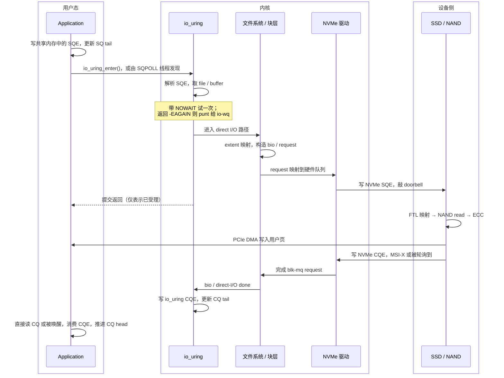

# io_uring 相比 AIO 改了什么

这篇只讲一件事：同样一个 I/O，走 `io_uring` 和走 Linux Native AIO（`io_submit`）到底差在哪，差出来的部分能换到多少性能。

链路中段 —— 从 VFS 到 NAND cell 那一大截 —— 两者完全一样，那部分的机制见[一次 AIO 请求的全链路](/hardware/aio-path)，那部分的能力边界见 [SSD 的能力边界与压榨路径](/hardware/ssd)。本文只在必要时给出跳转，不重复展开。

先把结论摆在前面：

> `io_uring` 优化的是主机软件路径，不会改变 PCIe、SSD 控制器、FTL、NAND 的物理上限。它减少系统调用、数据复制、线程切换、内存映射和完成通知成本，让应用更容易把 SSD 喂饱；喂饱之后，瓶颈依然落在控制器、PCIe、NAND 并行度和 GC 上。

下面仍以最典型的场景为主：

```text
NVMe SSD
+ 普通文件
+ O_DIRECT
+ READ/WRITE
+ io_uring
```

## 0. 四点差异，先看全貌 {#diff-summary}

后面每一节都在展开这张表里的某一行。

| | Linux Native AIO | `io_uring` |
|---|---|---|
| **提交路径** | 每批必须 `io_submit()` 进内核，内核再从用户地址复制 `iocb` | SQE 直接写在共享内存里，普通模式一次 `io_uring_enter()` 提交整批，SQPOLL 模式连这次都省掉 |
| **提交阻塞** | 提交线程碰上缺页、inode 锁、extent 分配就原地等（[细节](/hardware/aio-path#submit-blocking)） | 先带 `NOWAIT` 试一次，会阻塞就 punt 给内核的 io-wq worker，提交线程立刻返回 |
| **每 I/O 固定成本** | 每次都要查 fd table、pin 用户页、建 DMA 映射 | fixed files 和 registered buffers 把这些成本前置到注册时 |
| **适用范围** | 实际只在 `O_DIRECT` 上真异步，buffered I/O 会退化成同步 | 覆盖到 buffered I/O、网络、`fsync`、`openat` 等几十种 opcode，代价是可能落进 io-wq |

有一条常见的说法要先纠正：不能说"`io_uring` 的优势在于完成队列共享给用户态，不用像 `io_getevents()` 那样进内核"。libaio 的完成环同样是 mmap 到用户态的，有完成项时 `io_getevents()` 也能纯用户态取走。真正的差异在提交侧和上面那四行，不在"读完成能不能免 syscall"。

---

# 第一部分 · 提交侧

## 1. 先区分两组完全不同的环 {#two-rings}

`io_uring` 和 NVMe 都有 SQ/CQ，但不是同一组队列：

```text
应用
  │
  │ io_uring SQ/CQ      ← 用户态 ↔ 内核
  ▼
Linux 内核
  │
  │ blk-mq request
  ▼
NVMe 驱动
  │
  │ NVMe SQ/CQ          ← 驱动 ↔ SSD 控制器
  ▼
NVMe SSD
```

上面那组位于主机内存，SQE 表示"应用想让内核做什么"，CQE 表示"内核告诉应用做完了"。下面那组通常也位于主机内存（例外是 CMB），NVMe SQE 是驱动向 SSD 提交命令，NVMe CQE 是 SSD 向驱动报告完成（[细节](/hardware/aio-path#nvme-queue)）。

所以完整链路会经历两次"提交—完成"：

```text
用户写 io_uring SQE
    ↓
内核消费 io_uring SQE
    ↓
驱动写 NVMe SQE
    ↓
SSD 消费 NVMe SQE
    ↓
SSD 写 NVMe CQE
    ↓
内核完成 request
    ↓
内核写 io_uring CQE
    ↓
用户消费 io_uring CQE
```

这是理解全过程的骨架。本文讲的全部优化都发生在第一次"提交—完成"上，第二次那一段和 AIO 一模一样。

## 2. 建立 ring：`io_uring_setup()` {#setup}

应用创建 ring：

```c
io_uring_queue_init(entries, &ring, flags);
```

底层通过 `io_uring_setup()` 创建内核 ring context，然后把这些区域映射进用户地址空间：SQ ring、SQE array、CQ ring、CQE array，以及 head/tail 等控制字段。之后应用和内核就通过这些共享内存结构交换请求。

对照 AIO：

```text
Linux AIO：
用户准备 iocb
  → 每次通过系统调用把 iocb 指针交给内核
  → 内核从用户地址复制 iocb 进来

io_uring：
用户直接在共享内存中填写 SQE
  → 更新 SQ tail
  → 必要时再通知内核
```

所以 `io_uring` 减少的不是 SSD 访问时间，而是每个 I/O 在应用与内核之间的固定管理成本。

有一个容量细节值得注意：`entries` 指定的是 SQ 的深度，CQ 默认是它的两倍。这个默认值不是随便定的，原因见第 10 节的 CQE overflow。

## 3. 准备请求：SQE 长什么样 {#sqe}

应用从 SQ 取一个空闲 SQE：

```c
struct io_uring_sqe *sqe = io_uring_get_sqe(&ring);

io_uring_prep_read(sqe, fd, buf, len, offset);

sqe->user_data = request_id;
```

此时只是在写用户可访问的共享内存，还没有进内核。SQE 里携带 opcode、fd 或 fixed-file index、用户缓冲区地址或 registered-buffer index、长度、文件偏移、flags、`user_data`。

应用可以连续填很多个：

```text
SQE 0：read block A
SQE 1：read block B
SQE 2：write block C
...
SQE 63：read block Z
```

然后一次性提交。

## 4. 提交：`io_uring_enter()` 与批量 {#enter}

最常见的模式下，应用调用：

```c
io_uring_submit(&ring);
```

liburing 会根据 ring 状态决定是否真的发起 `io_uring_enter()`。进入内核后，大体做这些事：读 SQ head 和 tail、通过 SQ array 找到对应 SQE、稳定请求所需字段、校验 opcode/fd/地址/长度/flags、建立 `io_kiocb` 等内部状态、找到对应 `struct file`、调用文件类型对应的读写路径。

批量提交的关键是：

```text
填 64 个 SQE
    ↓
一次 io_uring_enter()
    ↓
内核消费 64 个请求
```

一次 syscall 的固定开销被 64 个请求摊薄。摊薄能换到多少，见第 14 节的成本模型。

但要注意：

> 一次 syscall 提交 64 个请求，不代表最终只有一个 NVMe 命令、一次 doorbell 或一次中断。

后面仍可能一个 SQE 拆成多个 bio/request、多个 request 分布到不同 NVMe queue、每个队列独立敲 doorbell、SSD 通过中断合并批量通知完成。"一个用户 I/O 未必对应一条 NVMe command"的机制原因（extent 不连续、超过最大传输大小、PRP 段数上限）见 [aio-path 第 5、7 节](/hardware/aio-path#fs-mapping)。

## 5. 第一个岔路：inline 执行还是 punt 给 io-wq {#punt}

这是 `io_uring` 区别于 AIO 最本质的一处，也是实际调优里最容易踩坑的一处。

内核拿到请求后，**并不是先判断再执行，而是先试再说**：它带着 `IOCB_NOWAIT` 原地发起这次操作。如果底层能不阻塞地完成提交，就走完；如果底层返回 `-EAGAIN`，说明这条路会睡，内核才把请求 punt 给 io-wq worker 线程重做一遍，这次不带 `NOWAIT`，允许阻塞。

### 路径 A：inline 直接进真正的异步 I/O 路径

对于典型的"支持异步 direct I/O 的文件系统 + `O_DIRECT` + NVMe 块设备"，内核可以快速完成请求验证、direct-I/O 准备、文件偏移到块地址映射、bio/request 构造，然后向块设备提交。提交线程立即返回，不需要等 SSD。

这条路径最能体现 `io_uring` 的优势。

### 路径 B：可能阻塞，punt 给 io-wq worker

会触发 `-EAGAIN` 的常见情形有：阻塞式文件操作、文件系统元数据读取、page fault、extent 分配、inode 锁等待、目录操作、某些网络或特殊文件路径、普通文件的特定 buffered I/O 路径。

```text
提交线程
  → io_uring：带 NOWAIT 试一次
      → -EAGAIN
          → io-wq worker：不带 NOWAIT 重做，允许阻塞
```

这意味着：

> `io_uring` 并不等于"内核完全不用线程"。

准确说法是三句：原生异步路径不需要"一个等待中的 worker 对应一个在途 I/O"；阻塞兼容路径可能由 io-wq worker 执行；应用不必自己维护传统阻塞线程池，但内核仍可能用工作线程兜底。

对比 AIO 就清楚了：同样碰上 inode 锁，`io_submit()` 是提交线程原地睡，后面排队的请求一个都发不出去；`io_uring` 是这一个请求交给 worker 去睡，提交线程继续处理下一个。但代价也在这里 —— 若大量请求落进 io-wq，线程调度、上下文切换、worker 数量和队列等待又会成为新的瓶颈。这是本文第 18 节要单独列一层的原因。

## 6. registered buffers：省掉每 I/O 的内存管理 {#registered-buffers}

普通请求直接携带用户地址：

```text
SQE.addr = 用户虚拟地址
```

内核每次都要做一整套和内存页有关的工作：检查地址范围、处理潜在缺页、pin 住用户页、构造内存段描述、DMA mapping，完成后再 unmap 并解除 pin。这套动作本身的机制（为什么虚拟连续不等于物理连续、IOMMU 的 IOVA 翻译从哪来）见 [aio-path 第 4 节](/hardware/aio-path#pin-page-iova)。

如果是 4 KiB 小 I/O，每次都做这些，CPU 成本非常显著。典型现象是：

```text
SSD 尚未达到标称 IOPS
但提交 CPU 已经 100%
```

此时瓶颈不是 SSD，而是页固定与释放、DMA map/unmap、IOMMU 映射、内存分配、bio/request 构造。

应用可以预先注册内存：

```c
io_uring_register_buffers(...)
```

注册时内核预先建立这些缓冲区的状态，之后请求用 buffer index 引用它们：

```text
每个请求："使用 registered buffer 7"
而不是："重新验证并处理地址 0x7f..."
```

它减少的是每次请求重复的用户内存校验、一部分 page pin/unpin 成本、部分映射和引用管理、请求建立开销。

但不要说成"注册一次后完全没有 DMA mapping 开销"。实际能消除哪类映射、映射保持多久，取决于内核版本、设备、IOMMU 和具体操作路径。更安全的表述是：

> registered buffers 让内核复用已经稳定的用户内存描述，显著减少高频小 I/O 的每请求内存管理成本。

也不要把它和 zero-copy 混为一谈，见第 21 节。

## 7. fixed files：省掉每 I/O 的 fd 查找 {#fixed-files}

普通 SQE 携带 `fd` 时，内核每次都要根据 fd 查文件对象，并处理引用和并发安全。应用可以预先注册：

```c
io_uring_register_files(...)
```

之后 SQE 里放的是 fixed-file table index，不是普通 fd。这样减少 fd table 查找、文件引用的获取与释放、共享 fd table 上的同步开销、某些原子引用计数操作。

单次收益很小。但目标若是每秒数百万个 4 KiB I/O，每个请求省掉几十到几百条指令就会产生可见影响 —— 具体能换多少 IOPS，见第 18 节第四层的算术。

---

# 第二部分 · 中段

## 8. 从 VFS 到 NAND：这一段和 AIO 完全一样 {#midpath}

一旦请求离开 `io_uring` 进入 VFS，后半程就和其他异步接口汇合了：

```text
io_uring request
  → VFS / filesystem       文件偏移 → LBA、extent、COW、journal
  → iomap / direct-I/O
  → bio
  → blk-mq request         映射到某个硬件队列
  → NVMe driver            构造 NVMe 命令、写 SQ、敲 doorbell
  → SSD                    FTL → NAND → ECC → DMA → 写 CQE
```

这一整段 `io_uring` 一个字节都没改，所以本文不再展开：

- 机制层面（extent 映射、PRP/SGL、doorbell、phase bit、MSI-X）见[一次 AIO 请求的全链路](/hardware/aio-path)。
- 能力层面（这一站的有限资源是什么、饱和时什么现象、能拧哪些旋钮）见 [SSD 的能力边界与压榨路径](/hardware/ssd)。

只强调一件和 `io_uring` 直接相关的事：一个 SQE 仍可能被拆成多个块请求。

```text
一个 128 KiB READ SQE
  ├── request A：extent 1
  ├── request B：extent 2
  └── request C：extent 3
```

只有所有子请求都完成，才生成最终那一个 io_uring CQE。所以：

> 一个 io_uring SQE 不等于一个 bio，也不一定等于一条 NVMe command。

同理，`io_uring` 不会改变 NAND 读延迟、program/erase 延迟、channel 与 die 数量、FTL 复杂度、GC、写放大、SLC cache 容量、PCIe 链路带宽、控制器算力和热降频。它只是更高效地把请求送到这里，再把完成结果拿回来。

---

# 第三部分 · 完成侧

## 9. NVMe 完成怎么变成 io_uring CQE {#cqe}

SSD 完成后，事件沿链路逐级向上：

```text
SSD 写 NVMe CQE
  → MSI-X 中断或主机轮询
  → NVMe 驱动消费完成项
  → blk-mq 完成 request
  → bio 完成
  → direct-I/O 完成
  → io_uring request 完成
```

前四步和 AIO 一致（[细节](/hardware/aio-path#msix)）。差异从最后一步开始：内核在 io_uring CQ ring 中写入 CQE，而不是往 AIO 完成环放 `io_event`。

```c
struct io_uring_cqe {
    __u64 user_data;   // 应用提交时设置的请求标识
    __s32 res;         // 完成字节数，或负的错误码
    __u32 flags;       // 额外完成信息
};
```

发布顺序必须正确：

```text
内核：填写 CQE 内容 → 内存屏障 → 更新 CQ tail
用户：读取 CQ tail → 获取语义 → 读取 CQE 内容
```

否则用户可能看到 tail 已经变化，读到的却是尚未写完的 CQE。这和 NVMe 侧"数据 DMA 先完成、再发布 CQE"是同一种发布—获取关系，只是换了一层。

## 10. CQ 满了会怎样：CQE overflow {#cqe-overflow}

SQ 满了很直观 —— 取不到新 SQE，应用提交不下去。完成侧的情况不一样，值得单独说。

如果应用收割不及时，CQ ring 会满。此时内核不会阻塞，而是把溢出的完成项挂进一条内核侧的溢出链表，等 CQ 腾出空间再补进去。这是 `IORING_FEAT_NODROP` 提供的保证；在更早的内核上，溢出的 CQE 会被直接丢弃，应用永远等不到那个请求的完成。

即使有 NODROP，溢出也不是免费的：溢出期间要额外分配内存、走一条慢路径，还会给 ring 打上 overflow 标志。所以 CQ 默认开成 SQ 的两倍，是为了给收割留出余量；真正的解法是别让在途请求数逼近 CQ 容量，而不是把 ring 无限开大。

## 11. 应用怎么等完成 {#reap}

三种常见方式。

**不阻塞地收割**。应用周期性检查 CQ head/tail，有 CQE 就批量处理。完成项已经在 CQ 里时，读它不需要系统调用。注意这一点对 AIO 同样成立（见第 0 节），也注意它在 IOPOLL 模式下不成立（见第 13 节）。

**阻塞等待**。应用通过 `io_uring_enter()` 要求"至少等 N 个完成项"，没完成就睡，完成到来内核唤醒。这仍然会产生 syscall、线程睡眠、调度、唤醒、cache 冷却，但可以一次等待批量取走多个 CQE，把这些成本摊薄。

**Busy polling**。应用不睡，持续读共享内存：

```text
while (没有 CQE)
    检查共享内存
```

好处是避免线程睡眠唤醒、降低调度延迟、尾延迟更稳。代价是持续占用 CPU、增加功耗，轮询位置不合理时还会制造 cache line 和 NUMA 流量。

## 12. `SQPOLL` 优化了什么 {#sqpoll}

启用 `IORING_SETUP_SQPOLL` 后，内核起一个 SQ polling 线程：

```text
常规模式：应用写 SQE → io_uring_enter() → 内核消费 SQE
SQPOLL：  应用写 SQE → 内核线程轮询 SQ 主动发现 → 内核提交 I/O
```

它消除或减少的是提交系统调用、用户线程进内核的切换、提交线程在内核路径中消耗的时间。它**没有**消除文件系统和块层处理、DMA mapping、NVMe 命令构造、doorbell、NAND 操作、完成处理。

有个实现细节要知道：SQPOLL 线程空闲一段时间后会自己睡下，此时应用必须发一次带 `IORING_ENTER_SQ_WAKEUP` 的 `io_uring_enter()` 把它叫醒。liburing 会检查标志位自动处理，但这意味着低负载下 syscall 并没有真的消失。

SQPOLL 线程持续忙轮询时会独占或大量占用一个 CPU 核。所以它的本质是：

> 用一个专用 CPU 核，换更低的提交开销和更稳定的延迟。

IOPS 不高时 SQPOLL 可能纯浪费 CPU，总能耗更差；若 SQPOLL 线程和应用线程、IRQ 或其他服务抢同一个核，还会反过来降低性能。

## 13. `IOPOLL` 优化了什么 {#iopoll}

启用 `IORING_SETUP_IOPOLL` 后，对支持轮询的 direct block I/O，完成不再主要依赖中断：

```text
普通完成：SSD 写 NVMe CQE → MSI-X → 中断处理 → io_uring 完成
IOPOLL：  SSD 写 NVMe CQE → 主动轮询设备完成队列 → io_uring 完成
```

它减少 MSI-X 中断开销、中断调度抖动、完成线程唤醒延迟和部分尾延迟。代价是 CPU 忙轮询、需要设备和 I/O 类型支持、通常要求 direct I/O、低负载下极不经济。

**一个关键细节**：IOPOLL 不是内核起个后台线程替你轮询设备。轮询发生在应用调用 `io_uring_enter(..., IORING_ENTER_GETEVENTS)` 之后、在内核上下文里进行。所以 IOPOLL 模式下必须发 syscall 才能推动完成 —— 第 11 节"有 CQE 就直接读、不用 syscall"在这里不成立。

两个 poll 优化的是完全不同的方向：

| 模式 | 优化方向 | 代价 |
|---|---|---|
| SQPOLL | 用户请求如何进入内核 | 一个内核线程占核 |
| IOPOLL | 设备完成如何被内核发现 | 应用线程在内核里烧 CPU |

二者组合可以形成接近"轮询式存储数据面"的模式，但请求仍然要过文件系统、块层和内核请求管理，并不等同于 SPDK 的用户态 NVMe 驱动。

## 14. 完整时序 {#timeline}

以 direct read 为例：



---

# 第四部分 · 调优

## 15. 批量为什么有效 {#batching}

设单次系统调用固定成本为 `Cs`，每个请求的处理成本为 `Cr`，批大小为 `B`：

```text
C_per_IO = Cr + Cs / B
```

代入 `Cs = 600 ns`、`Cr = 1000 ns`：

```text
逐个提交：  1000 + 600      = 1600 ns/IO  → 约 625K IOPS
每批 32 个：1000 + 600 / 32 ≈ 1019 ns/IO  → 约 981K IOPS
```

真实系统当然更复杂，但原理就是固定成本被摊薄。

批量同样适用于完成端：一次看到 32 个 CQE，就能连续读取、连续回收请求对象、连续准备下一批 SQE，减少分支和函数调用、睡眠唤醒、cache miss、共享数据同步和每个完成项的通知成本。

注意区分这里的 batch 和队列深度 QD 是两件事：batch 摊薄的是主机侧每次 syscall 的固定成本，QD 决定的是设备内部有多少并行资源被用起来（[QD 的收益曲线见 ssd.md](/hardware/ssd#queue-depth)）。

## 16. 批量过大为什么伤延迟 {#batch-latency}

假设非要等够 64 个请求才提交：第 1 个请求准备好之后，要干等后面 63 个；这段时间 SSD 可能是空闲的。吞吐上去了，但第 1 个请求的延迟变差。

完成端同理：为了摊薄唤醒成本而等更多完成项，已经完成的请求就不能立刻交给业务处理。

所以合理策略是：

```text
有足够请求时批量
低负载时及时提交
对设备设置合理的 in-flight 上限
```

而不是无限增大 batch 和 QD。

## 17. Linked SQE 会让 SSD 更快吗 {#link}

`IOSQE_IO_LINK` 可以表达一条依赖链：

```text
读 A 完成 → 再写 B → 再 fsync
```

好处是应用不必在每一步完成后"醒来 → 解析结果 → 提交下一步"，省掉了用户态往返。

但链中的操作不能并行。`A → B → C` 链越长，总延迟越接近各步之和。所以 link 优化的是工作流控制开销，不会消除真实的依赖延迟。尤其：

```text
WRITE → FSYNC
```

最终仍需 SSD 执行 flush/FUA 的持久化语义，快慢由设备和文件系统决定（[持久化语义细节](/hardware/aio-path#write-durability)）。

## 18. 多个 ring 还是共享一个 ring {#ring-topology}

**多线程共享一个 ring**：管理简单、资源集中、容易凑出大 batch。潜在瓶颈是 SQ/CQ 的 head/tail cache line 竞争、多生产者同步、请求分发和完成归属复杂、跨 CPU 访问。

**每线程或每 CPU 一个 ring**：cache 局部性更好、共享写入更少、更容易绑定到 CPU、NUMA 和 NVMe queue。代价是更多 ring 内存、文件与 buffer 注册管理更复杂、负载不均时有的 ring 堵有的 ring 闲、完成处理和连接迁移更复杂。

高 IOPS 设计通常是这个形状：

```text
每 CPU / 每核业务分片
  → 独立 ring
  → 独立 buffer pool
  → 尽量固定 CPU
  → 匹配 NVMe queue 和 IRQ
```

理想情况下 CPU 0 上的应用 → CPU 0 的 blk-mq context → NVMe queue 0 → queue 0 的完成中断回到 CPU 0，这样 SQ 相关 cache line 留在本 CPU、request 状态留在本 CPU cache、减少跨 CPU cache line 迁移和跨 NUMA 访问。但实际映射会被 CPU affinity、IRQ affinity、blk-mq queue 映射、NUMA 拓扑、线程迁移、NVMe queue 数量搞乱。例如应用在 NUMA node 0、buffer 在 node 1、NVMe 挂在 node 0、完成 IRQ 却落在 node 1，就会产生大量跨 socket 流量。

是否真的更快必须实测，不能凭"多个 ring"推断。

---

# 第五部分 · 瓶颈与总结

## 19. 瓶颈停在哪一层 {#bottleneck-layers}

整条链路的上限仍然是各站取最小，这个 min 结构和对应的推论（**优化非瓶颈环节没有任何收益**）在 [ssd.md 第 9 节](/hardware/ssd#iops-min)已经讲过，这里不重复。本节只列 `io_uring` 特有的前四层 —— 也就是换用 `io_uring` 之后瓶颈依次会停在的位置。

### 第一层：应用生成请求的速度

应用每个请求都要跑业务逻辑、选 buffer、填 SQE、管理 `user_data`、处理 CQE、回收请求对象。如果每个请求还要动态分配内存、加全局锁、操作复杂映射表、在多个线程间传递、逐个提交逐个回收，那么 SSD 还没满，应用 CPU 就先满了。

```text
SSD 设备利用率不高
应用单核 100%
QD 上不去
```

优化方向：请求对象池化、buffer 池化、每线程独立 ring 或分片 ring、批量准备 SQE、批量处理 CQE、避免共享计数器和全局锁。

### 第二层：ring 本身的排队空间

生产速度超过内核消费速度时，SQ head 追不上 tail，SQ 满，应用取不到新 SQE。这不是 SSD 的 IOPS 上限，而是软件排队空间耗尽。可能原因：ring entries 太小、提交批次不合理、SQPOLL 线程没拿到 CPU 时间、大量请求在内核入口阻塞、io-wq 或文件系统压力过大。完成侧对应的是第 10 节的 CQE overflow。

把 ring 开得特别大不是免费午餐：占用更多锁页内存、工作集更大、cache 局部性变差、允许应用积累过多排队请求、尾延迟增大。

### 第三层：io-wq

请求走不了原生异步路径就会进 io-wq，此时系统逐渐退化成一种内核管理的线程池：

```text
io_uring SQE → io-wq 队列 → worker 线程 → 阻塞操作
```

瓶颈变成 worker 数量、worker 创建和调度、上下文切换、文件系统锁、worker 睡眠唤醒、work queue 排队。典型现象是 io-wq worker 数量很大、上下文切换率升高、syscall 少了但 CPU 仍然高、高并发下延迟突然恶化、direct I/O 明显比 buffered I/O 稳定。

> `io_uring` 接口异步，不代表后端执行机制一定原生异步。

### 第四层：文件和 buffer 的每 I/O 固定成本

不用 fixed files 和 registered buffers 时，每个 I/O 要额外付出 fd lookup、引用计数、用户页处理、pin/unpin、DMA map/unmap、IOMMU 更新。对 4 KiB 随机 I/O，这些固定成本占比很高。

算一笔账。假设设备侧一次 4 KiB 随机读约 80 μs，主机每 I/O 消耗 2 μs CPU 时间。即使 I/O 在设备上是异步执行的，CPU 也必须为每个 I/O 付这 2 μs，所以单核提交能力是：

```text
1 / 2 μs = 500K IOPS
```

注册固定资源不会让 NAND 变快，但能把每 I/O 的 CPU 时间从 2 μs 压到 1 μs，单核驱动能力就从约 500K 提到约 1M IOPS。这就是第 6、7 节那两个注册接口的实际价值。

### 再往下：交给另外两篇

第五层往后就不是 `io_uring` 的战场了：文件系统的 extent 分配、inode 锁和 journal 见 [ssd.md 第 2 节](/hardware/ssd#fs-cost)；blk-mq 的 tag 耗尽、队列映射和跨 NUMA 竞争见[第 3、4 节](/hardware/ssd#blk-mq)；PCIe 带宽见[第 5 节](/hardware/ssd#pcie-bw)；控制器命令处理率见[第 6 节](/hardware/ssd#controller)；NAND 并行度和 QD 的收益拐点见[第 7、10 节](/hardware/ssd#nand-parallel)；写入稳态、SLC cache 耗尽和写放大见[第 12 节](/hardware/ssd#write-path)。

只补一句和 `io_uring` 相关的提醒：它太容易制造大量并发了，所以特别容易出现这种情况 ——

> 应用以为"异步越多越好"，实际只是把几千个请求压进设备队列，IOPS 一点没涨，尾延迟严重恶化。

同理，`io_uring` 提交得更快，也就更快把 SLC cache 写满、更早暴露稳态性能。所以基准测试只跑十秒，测到的可能是缓存性能，不是 NAND 稳态性能。

## 20. 从指标判断瓶颈在哪 {#diagnose}

通用的"从 fio 曲线形状反推瓶颈站"对照表在 [ssd.md 第 14 节](/hardware/ssd#diagnose)，QD 涨不涨 IOPS、大 I/O 撞带宽、写入掉速、尾延迟恶化这几类都在那里。这里只补两条 `io_uring` 特有的形状。

**一个 CPU 核 100%，SSD 没满。** 可能是 SQE/CQE 处理、请求对象管理、fd lookup、buffer pin/map、syscall 过多、单 ring 或单线程到顶。验证方向：增大提交和完成 batch、上 fixed files、上 registered buffers、拆多线程多 ring、看 IOPS 是否随 CPU 数增长、对比开 SQPOLL。

**io-wq 线程很多，上下文切换很高。** 说明请求频繁掉进阻塞兜底路径，常见诱因是 buffered I/O、文件系统元数据与锁、本身就不支持真异步的操作。验证方向：换预分配文件、对比开 `O_DIRECT`、检查是否被强制异步执行、观察请求是否进了 io-wq、降低共享文件上的写入竞争。

## 21. 一个瓶颈迁移的例子 {#migration}

4 KiB 随机读，设备侧单次约 80 μs，SSD 硬件上限约 1M IOPS。每一阶段都可以用 `IOPS ≈ QD / Latency` 自检。

| 阶段 | 配置 | 结果 | 说明 |
|---|---|---|---|
| 一 | batch=1，QD=1，不注册 | 12K IOPS，延迟约 85 μs | 设备 80 μs + 主机约 5 μs，全程串行，并行度为零 |
| 二 | batch=32，QD=64 | 600K IOPS，延迟约 107 μs | 同时隐藏了设备延迟、摊薄了 syscall |
| 三 | 加上 fixed files / registered buffers | 850K IOPS，延迟约 75 μs | 每 I/O CPU 成本下降，说明原来的瓶颈有一部分在主机内存和 fd 管理 |
| 四 | QD 提到 256 | 950K IOPS，延迟约 270 μs | IOPS 只涨了 12%，延迟涨了 3.6 倍，设备接近饱和 |
| 五 | QD 提到 1024 | 960K IOPS，延迟超过 1 ms | 后端到顶，增加并发只增加排队，P99 更差 |
| 六 | 开 SQPOLL / IOPOLL | 1.0M IOPS，尾延迟改善，多耗 1～2 个核 | 最后一点主机提交和完成开销被削掉，然后撞上 SSD 的硬件上限 |

从第四阶段起，`io_uring` 已经不是矛盾的主要方面了 —— 那之后的每一分收益都要去 ssd.md 那条链路上找。

## 22. 最容易误判的地方 {#pitfalls}

**"没有 syscall，所以没有内核开销"。** 不对。SQPOLL 只减少提交 syscall，而且它空闲睡下后还要靠 syscall 唤醒；内核仍要完成文件系统、块层、DMA mapping、驱动和完成处理。

**"SQE 直接发给 NVMe"。** 不对。io_uring SQE 由 Linux 内核消费，NVMe 驱动再另外构造一份 NVMe SQE，两组环见第 1 节。

**"ring entries 越大性能越好"。** 不对。entries 只决定可排队容量，不等于设备需要的最佳 QD。过多排队只会恶化尾延迟。

**"registered buffer 就是 zero-copy"。** 不完全准确。对 `O_DIRECT` read/write，数据本来就可以在 SSD 和用户页之间直接 DMA、不经 page cache 拷贝，那是 `O_DIRECT` 的功劳（[细节](/hardware/aio-path#o-direct)）；buffer 注册省的是内存描述的重复建立和管理成本。两件事不是一回事。

**"io_uring 完全不用线程池"。** 不对。可能阻塞的操作会 punt 进 io-wq，见第 5 节。

**"CQE 出现代表写入已经掉电持久化"。** 不对。普通 write 完成不等于 `fsync`、Flush 或 FUA 语义（[细节](/hardware/aio-path#write-durability)）。

**"IOPOLL 永远比中断快"。** 不对。它用 CPU 换延迟，低负载下浪费资源，CPU 争用严重时甚至更差。

**"完成队列共享是 io_uring 独有的优势"。** 不准确。libaio 的完成环同样映射到用户态，见第 0 节。

## 23. 一句话总结 {#summary}

> 应用先把请求描述符写进用户与内核共享的 SQ，并批量更新 tail。普通模式通过一次 `io_uring_enter()` 通知内核，SQPOLL 模式则由内核轮询线程主动消费。内核解析 SQE 后带着 `NOWAIT` 原地试一次：能不阻塞就走完 direct I/O、bio、blk-mq、NVMe 驱动这条原生异步路径；返回 `-EAGAIN` 就 punt 给 io-wq worker 重做。
>
> 从 VFS 往下的整段 —— NVMe 命令构造、doorbell、PCIe DMA、FTL、NAND、ECC、CQE 回写、MSI-X —— 和 Linux Native AIO 完全一样。完成事件依次回溯 blk-mq request、bio、direct-I/O，最后由内核把 CQE 发布到用户可见的 io_uring CQ 中。
>
> 所以 `io_uring` 的全部价值都在链路前半段：共享队列减少系统调用，批量提交和完成摊薄固定成本，fixed files 减少 fd 查找，registered buffers 减少每 I/O 内存管理，SQPOLL 减少提交切换，IOPOLL 减少中断和唤醒延迟，punt 机制让提交线程不再被单个阻塞请求卡住。它不会改变 PCIe 带宽、控制器命令率、NAND 延迟、channel/die 数量、GC 和写放大。

凝练成一句：

> **`io_uring` 不是把 SSD 变快，而是减少"喂饱 SSD"所需要的 CPU；当 SSD 被喂饱之后，真正的瓶颈仍然由 PCIe、控制器和 NAND 结构决定。**
