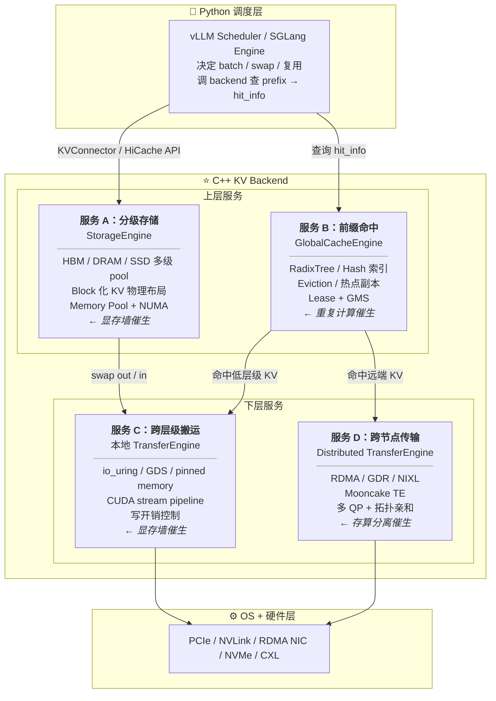
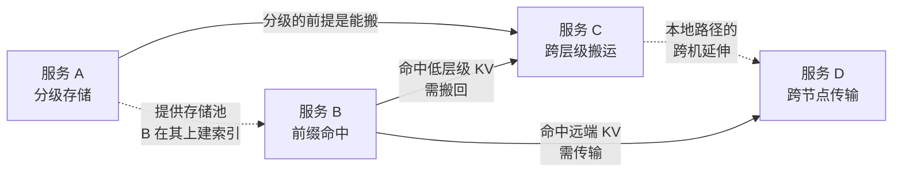

# KV Cache C++ Backend 优化方向细则

> 从推理场景的根本压力出发，回答：C++ backend 为推理提供了哪些服务？为什么需要这些服务？怎么实现？

::: info 这份文档的定位
相关的三份文档：
- **[推理 IO 优化：完整技术全景](/infra/inference-io-tech-complete)** —— 9 层全景图，覆盖从芯片内到跨数据中心的 IO 技术
- **[AI 存储 · KV Cache 基础项目总览](/projects/overview)** —— 渐进式 C++ 项目路线图

工作落在 **推理框架的 C++ KV backend 这一层**（vLLM `KVConnector` / SGLang `HiCache` / FlexKV `StorageEngine|TransferEngine` / Mooncake `Transfer Engine` 的共同战场）。本文以"推动力量 → 推理需求 → C++ backend 服务 → 技术实现"为线索，回答：

**C++ backend 为推理提供哪些服务，这些服务为什么被需要？**
:::

---

## 一、推动力量：推理场景对 C++ backend 的需求从何而来

大规模 LLM 推理对 KV cache 的压力可以归结为三股根本力量。每一股力量都直接催生出推理框架对 C++ backend 的具体需求，进而定义了 backend 必须提供的服务。

### 1.1 显存墙：KV 线性增长 vs HBM 固定容量

**现象**：KV cache 随上下文长度线性增长（每 token 产生固定大小的 K/V 向量），单卡 HBM（80-192 GB）迅速触及内存墙。上下文越长、batch 越大，矛盾越尖锐。

**后果**：
- 驱逐旧 KV → 历史 token 重算（多轮对话尤甚，用户等两轮之间响应时间翻倍）
- 限制 batch size → 吞吐下降
- 限制上下文长度 → 无法服务长文档 / 多轮场景

**催生的需求**：**让显存容纳更多 KV，且驱逐后不必重算** → C++ backend 提供 **分级存储服务**（HBM/DRAM/SSD 多级 pool + swap）

### 1.2 重复计算：多请求共享前缀

**现象**：生产环境中，大量请求共享相同的 system prompt、工具描述、多轮历史。这些共享前缀被每个请求独立 prefill，算力大量浪费。

**后果**：
- 相同前缀被重复 prefill → GPU 计算资源浪费
- 共享前缀越长 → 浪费比例越大（system prompt + 工具描述可占数千 token）
- 多轮对话中历史逐轮重算 → 延迟线性增长

**催生的需求**：**相同前缀只算一次，后续请求直接复用** → C++ backend 提供 **前缀命中服务**（索引 + 查询 + 命中回调）

### 1.3 存算分离：PD 分离与大 EP 需要 KV 跨节点流动

**现象**：PD 分离（Prefill/Decode 拆到不同节点）、大 EP（Expert Parallelism 跨多机）、多模型协作等架构下，KV 必须从 prefill 节点传输到 decode 节点。单机读写流量被放大，单次 IO size 显著增大。

**后果**：
- KV 须跨节点高速传输 → 网络成为瓶颈
- 多节点同时向单点送 KV → 拥塞与长尾延迟
- 网络拓扑不亲和 → 带宽利用率低

**催生的需求**：**KV 在节点间高速、可靠地流动** → C++ backend 提供 **跨节点传输服务**（RDMA/GDR + 流控 + 拓扑亲和）

### 1.4（次要）冷启动：模型加载慢，弹性扩容受限

**现象**：大模型冷启动加载慢（数百 GB 权重从 SSD/远端拉取），弹性扩容受限。技术栈与 KV 路径相通，但非本文重点。

**催生的需求**：**权重提前进多级缓存，推理实例直接读取** → 与 KV 分级存储技术栈重叠，单独做 ROI 较低

::: warning 三股力量的优先级
- **1.1 显存墙 + 1.2 重复计算** 最有 PR 切入点——FlexKV/Mooncake 密集迭代
- **1.3 存算分离** 技术深度最高——但需要 RDMA / 多机环境，门槛高
- **1.4 冷启动** 是 EIC 的单独卖点——其他开源系统覆盖不深，单独做 ROI 较低

主要发力在 **1.1 + 1.2**，**1.3** 作为博客与深度延展。
:::

---

## 二、C++ Backend 为推理提供的服务

从三股推动力量直接导出 C++ backend 对外提供的服务。每个服务从"推理框架的调用场景"出发，定义服务的能力边界和语义保证。

### 服务全景图



::: tip 这张图与全景图的关系
[全景图](/infra/inference-io-tech-complete) 里 Layer 5（通信库）+ Layer 7（异步 IO）+ Layer 8（框架 KV 模块）的代码实体，几乎都在 C++ backend 里实现。这是从"代码组织"视角重新切的同一件事。
:::

::: warning prefix 索引的位置容易混淆
- **单进程内**的 prefix 命中（vLLM APC、SGLang RadixCache）—— 索引在 Python 侧，C++ backend 不参与
- **跨进程 / 跨节点**的 prefix 命中（FlexKV、Mooncake、EIC）—— 索引下沉到 C++ 独立服务，以规避 GIL、IPC 序列化、跨节点同步开销
- 图中 `GlobalCacheEngine` 解决的是后者；前者由推理框架本体内置完成
:::

### 服务 A：分级存储服务（StorageEngine）

**催生力量**：显存墙（§1.1）—— HBM 放不下所有请求的 KV，需要将冷 KV 搬到更便宜的介质，腾出显存容纳更多请求。

**推理框架的调用场景**：
- Scheduler 发现显存不足 → 调 backend swap out 冷 KV 到 DRAM/SSD
- 新请求到来 → 调 backend swap in 历史 KV（多轮对话、长上下文）
- 请求完成 → 调 backend 释放或保留 KV block（取决于是否可复用）

**服务的核心能力**：
- **多级介质池**：HBM / pinned DRAM / SSD / Remote，KV block 按热度自动升降级
- **Block 化布局**：固定大小 block，保持与 GPU KV 相同 shape，按 block id 算 offset
- **空间分配与回收**：启动预分配 Memory Pool，运行时只动 block table，避免 `cudaMalloc` 同步开销
- **持久化 + 热升级**：进程重启时 in-memory cache 不丢

**关键设计权衡**：
- **block 大小**：太小则索引膨胀 + 元数据开销，太大则内部碎片 + 命中粒度差。FlexKV/vLLM 通常 16 tokens/block，按 KV head 形状适配
- **同步 vs 异步 evict**：同步简单但阻塞写入；异步需 backpressure + epoch 防 use-after-free
- **inline metadata vs 集中索引**：每 block 自带 metadata 易于 GC，但读路径多一次解析

**服务依赖**：分级存储的前提是能跨层级搬运 → 依赖服务 C（跨层级搬运）

### 服务 B：前缀命中服务（GlobalCacheEngine）

**催生力量**：重复计算（§1.2）—— 多请求共享 system prompt / 多轮历史，相同前缀被重复 prefill。

**推理框架的调用场景**：
- 新请求到来 → 调 backend 查询前缀命中 → 拿到 hit_info（命中了哪些 block、在哪个节点）
- Scheduler 拿到 hit_info → 跳过已命中的 prefill token，只算未命中的部分
- 命中的 KV 在远程 → 调 backend 传输到本地 → 依赖服务 D（跨节点传输）

**服务的核心能力**：
- **前缀索引**：RadixTree 或 Hash 索引，token 前缀 → block ids 的映射
- **跨进程 / 跨节点查询**：本地快照 + GMS（Global Meta Store，典型用 Redis）上传与重建
- **Eviction 策略**：LRU / LFU / ARC / W-TinyLFU / TTL，冷 KV 自动淘汰
- **热点识别 + 副本**：高频前缀自动多副本，避免单节点瓶颈
- **Copy-on-Write block 共享**：多请求共享相同 prefix block，新增 token 才分裂

**关键设计权衡**：
- **prefix 粒度**：按 token / block / 字节 hash，影响命中率与索引大小
- **索引在 GPU 还是 CPU**：HBM 索引快但占显存；CPU 索引省显存但查表有额外延迟
- **强一致 vs 最终一致**：分布式 RadixTree 通常用 lease + 心跳的最终一致，不用 Raft（面试常问点）

**服务依赖**：命中后的 KV 若在远程 → 依赖服务 D（跨节点传输）；命中的 KV 若被驱逐到低层级 → 依赖服务 C（跨层级搬运）

### 服务 C：跨层级搬运服务（本地 TransferEngine）

**催生力量**：显存墙（§1.1）—— 分级存储定义了"KV 应该在哪"，搬运服务负责"把 KV 搬到那里"。

**推理框架的调用场景**：
- swap-out：HBM → pinned DRAM → SSD，与计算重叠，不阻塞下一步
- swap-in：SSD → pinned DRAM → HBM，必须在计算前就绪
- prefetch：预测性预取下一层 KV，减少 swap-in 等待

**服务的核心能力**：
- **异步搬运与计算重叠**：多 CUDA stream pipeline，一条流计算、另一条流做 H2D/D2H 拷贝，事件同步
- **SSD IO 路径**：io_uring 异步盘 IO + O_DIRECT 绕开 page cache + 全链路零拷贝
- **GDS (GPUDirect Storage)**：NVMe DMA 直写 GPU HBM，绕开 CPU DRAM
- **Double buffering / prefetch**：两块 buffer 交替，提前预取下一层 KV
- **写开销控制**：多流同步、并发复制、异步后台写、网卡亲和

**关键设计权衡**：
- **同步 swap-in vs 异步**：swap-in 同步必到（计算前就绪），swap-out 异步（不阻塞下一步）
- **GDS 还是先到 CPU 中转**：GDS 路径短延迟低，但要求 GPU/SSD/NIC 同 PCIe 拓扑；不满足则退化为 staging 路径
- **bounce buffer**：中间缓冲区大小决定流水线深度与内存峰值

### 服务 D：跨节点传输服务（Distributed TransferEngine）

**催生力量**：存算分离（§1.3）—— PD 分离、大 EP、跨节点 prefix 复用需要 KV 在节点间高速流动。

**推理框架的调用场景**：
- PD 分离：Prefill 节点算完 KV → 调 backend 传到 Decode 节点
- 跨节点 prefix 命中：查询命中远端 KV → 调 backend 传输到本地
- 热点副本：高频前缀的 KV 副本从源节点同步到目标节点

**服务的核心能力**：
- **RDMA / GDR 高速传输**：NIC DMA 直达 GPU HBM，绕过 CPU DRAM
- **Mooncake Transfer Engine / NIXL**：多 backend（TCP/RDMA/NVMeOF/NVLink）统一接口，自动拓扑发现
- **流控与拥塞**：多 QP 并发分流、DCQCN/PFC + 应用层节流、多打一调度
- **传输粒度优化**：slice 太小则 CPU 切片开销，太大则 QP 利用率低
- **多网卡 + 拓扑亲和**：按 GPU ↔ NIC 的 PCIe / NUMA 关系就近选 NIC

**关键设计权衡**：
- **同步 vs 异步 transfer**：异步吞吐高，但需完成事件正确传播到上游调度
- **bonded NIC + 多 QP**：bonded 网卡上单 `submitPostSend` 不分流会浪费带宽（Mooncake [#1668](https://github.com/kvcache-ai/Mooncake/issues/1668)）
- **NVLink vs RDMA vs TCP 自动选**：Mooncake TE 已做拓扑发现，发现错的边界条件是 PR 机会

### 服务间的依赖关系



- **A → C**：分级存储定义了"KV 应该在哪"，搬运服务执行搬运动作
- **B → A**：前缀命中在存储池上建索引，存储池是命中的物理基础
- **B → D**：命中的 KV 若在远端，需跨节点传输取回
- **C → D（概念上）**：跨层级搬运是本地路径，跨节点传输是其跨机延伸；工程上常由同一 TransferEngine 统一管理

---

## 三、服务的物理实现：四个子方向

将四个服务的核心能力展开为具体技术清单，对位到生产系统的模块实现。

### 3.1 子方向 A：单机多级存储引擎（StorageEngine）

**对应模块**：FlexKV `StorageEngine` · EIC "单机引擎" · LMCache `StorageBackend`。

| 技术点 | 含义 | 对应 EIC 的描述 |
|--------|------|-----------------|
| **Block 化布局** | 固定大小 block，保持与 GPU KV 相同 shape，按 block id 算 offset | FlexKV "groups multiple tokens into a block" |
| **Memory Pool** | 启动预分配，运行时只动 block table，避免 `cudaMalloc` 同步开销 | "进程故障在线热升级，写入内存缓存不丢失" |
| **Hugepage / NUMA Aware** | 大页 + NUMA bind | "Hugepage、Numa Aware、JumboFrame" |
| **内存索引压缩** | block id → 物理地址的索引需紧凑表示 | "软硬件结合解压缩、内存索引压缩" |
| **磁盘 GC + 磁盘视图** | SSD tier 的空间回收、磁盘格式抽象 | "磁盘视图、磁盘 GC" |
| **全链路零拷贝** | 用户态 buffer → block storage 不经多余拷贝 | "磁盘路径全链路零拷贝" |
| **持久化 + 热升级** | 进程重启时 in-memory cache 不丢 | "毫秒级快速恢复" |

### 3.2 子方向 B：缓存复用与索引（GlobalCacheEngine）

**对应模块**：FlexKV `GlobalCacheEngine` · SGLang `RadixCache` · vLLM `PrefixCache (APC)` · EIC "PrefixCache 共享 + 前缀 hash"。

| 技术点 | 含义 | 实现细节 |
|--------|------|----------|
| **RadixTree 索引** | 压缩字典树存 token 前缀 → block ids | FlexKV、SGLang 用，比 hash 表更适合 prefix |
| **Hash 前缀索引** | 按 block_size 算 prefix hash，命中查表 | vLLM 风格，多机间易同步 |
| **分布式 RadixTree** | 每节点持本地快照，避免查询走网络 | FlexKV "Each node maintains a local snapshot of the global index" |
| **GMS（Global Meta Store）** | 元数据集中存储（典型用 Redis），节点间上传 + 拉取重建 | FlexKV "Upload & Rebuild" |
| **Lease 机制** | 跨节点取数据时确保未被驱逐 | FlexKV "Lease Mechanism" |
| **Eviction 策略** | LRU / LFU / ARC / W-TinyLFU / TTL | EIC "TTL、LRU/ARC/FIFO" |
| **热点识别 + 副本** | 高频前缀自动多副本，避免单节点瓶颈 | EIC "热点缓存识别 + 副本自动扩展" |
| **Copy-on-Write block 共享** | 多请求共享相同 prefix block，新增 token 才分裂 | vLLM 内部 + SGLang RadixCache |

### 3.3 子方向 C：跨层级传输（本地 TransferEngine）

**对应模块**：FlexKV 本地 `TransferEngine` · EIC "内存/设备/网卡亲和性" · LMCache async transfer。

| 技术点 | 含义 | 工具 / 库 |
|--------|------|-----------|
| **Pinned memory** | page-locked 内存，DMA 直接访问 | CUDA Runtime |
| **多 CUDA stream pipeline** | 一条流计算、另一条流做 H2D/D2H 拷贝，事件同步 | `cudaStream_t` + `cudaEventRecord` |
| **`cudaMemcpyAsync` 重叠** | 异步拷贝，不阻塞 host 调度 | CUDA Runtime |
| **io_uring 异步盘 IO** | submission/completion queue 提交读写 | `liburing` |
| **O_DIRECT 绕开 page cache** | KV 一次性读写，page cache 反而浪费 DRAM 带宽 | `open(O_DIRECT)` |
| **GDS (GPUDirect Storage)** | NVMe DMA 直写 GPU HBM，绕开 CPU DRAM | `cuFile` API + `nvidia-fs.ko` |
| **Double buffering / prefetch** | 两块 buffer 交替，提前预取下一层 KV | 自研逻辑 |
| **多网卡 / NUMA 亲和** | KV 来自最近 NUMA + PCIe root complex 上的 NIC | `numa_alloc_onnode`、`hwloc` |
| **写开销控制** | 多流同步、并发复制、异步后台写、网卡亲和 | EIC "推理时写开销控制" |

### 3.4 子方向 D：跨节点传输（Distributed Transfer Engine）

**对应模块**：Mooncake `Transfer Engine` · NIXL · FlexKV "分布式 KVCache reuse" · EIC GDR 子系统。

| 技术点 | 含义 | 库 / API |
|--------|------|-----------|
| **RDMA Verbs** | 直接调 `ibv_post_send`/`ibv_post_recv` | `libibverbs` |
| **RDMA 多 QP 并发** | 每 endpoint 多个 Queue Pair，单 transfer 内 round-robin 分流 | Mooncake `MC_NUM_QP_PER_EP`、`MC_SLICE_SIZE` |
| **GPUDirect RDMA** | NIC DMA 直达 GPU HBM，绕过 CPU DRAM | `nvidia-peermem` + verbs |
| **Mooncake Transfer Engine** | 多 backend（TCP/RDMA/NVMeOF/NVLink）统一接口，自动拓扑发现 | `libtransfer_engine` |
| **NIXL** | NVIDIA 的 KV 传输标准抽象层，Mooncake / UCX 已是 backend | `nixl::createBackend` |
| **控制面 vs 数据面分离** | ZMQ 等做元数据握手；RDMA / NIXL 跑实际 KV | EIC PD 分离 "ZMQ + NIXL" |
| **多打一调度** | 多节点同时往单点送 KV 的流控与拥塞 | DCQCN/PFC + 应用层节流 |
| **传输粒度优化** | slice 太小则 CPU 切片开销，太大则 QP 利用率低 | Mooncake `MC_SLICE_SIZE` 调优 |

---

## 四、为什么是 C++ Backend 这一层

有了前面"推动力量 → 服务"的逻辑，可以更清晰地回答：为什么这些服务落在 C++ backend 而不是其他层？

### 4.1 全景图的 9 层，每一层 ROI 不同

[推理 IO 优化技术全景](/infra/inference-io-tech-complete) 列了 9 层。对一个有存储背景、转向 AI infra 的工程师，可切入程度并不相同：

| 层级 | 谁在做 | 我能切入吗 |
|------|--------|------------|
| Layer 1 芯片内（Flash Attention / Quantization / Kernel Fusion） | 算法 + CUDA kernel 工程师 | ❌ 偏算法 |
| Layer 2 GPU 内存管理（PagedAttention / Continuous Batching） | 推理框架核心开发 | ❌ 框架核心，已成熟 |
| Layer 3 节点内互联（PCIe / NVLink / GDS / CXL） | 硬件 + 系统驱动 | ⭕ 概念必懂，工程改不到 |
| Layer 4 跨节点网络（RDMA / GDR / DPU） | 网络 + 系统软件 | ⭕ 接口层可做 |
| **Layer 5 通信库栈（UCX / NIXL / Mooncake TE）** | **存储 + 网络系统工程师** | **✅ 主战场**（NCCL 偏 collective comm，非 KV 传输主流） |
| Layer 6 并行策略（TP / PP / EP / PD 分离） | 系统架构师 | ❌ 架构层 |
| Layer 7 异步 IO / 重叠（CUDA stream / 双 buffer） | 横跨多层 | ✅ backend 内大量使用 |
| **Layer 8 推理框架 KV 模块（vLLM/SGLang/TRT-LLM/Dynamo）** | **框架贡献者** | **✅ 主战场（KV Connector）** |
| Layer 9 观测与 Profiling | 全栈通用 | ⭕ 工具 |

**结论**：入手点在 **Layer 5（KV 传输库 / Mooncake TE / FlexKV TransferEngine）** 与 **Layer 8（vLLM KV Connector / SGLang HiCache）的 C++ 部分** 的交集。

### 4.2 四个子问题，C++ Backend 覆盖三个

[边界文档](https://github.com/run-qing-spo/kvcache_way) 把 KV cache 拆成 4 个子问题：

```
① 怎么"存"    ── 张量内存 layout、block 化、分页
② 怎么"复用"  ── prefix 命中跨请求 (同进程 / 跨进程 / 跨节点)
③ 怎么"分级"  ── GPU HBM ↔ CPU RAM ↔ SSD ↔ 远程
④ 怎么"传输"  ── 节点间搬 KV（P/D 分离、RDMA、共享 pool）
```

- ① 由推理框架本体（vLLM PagedAttention / SGLang RadixAttention）解决
- **② ③ ④ 在 C++ backend 这一层**——EIC、FlexKV、Mooncake 的共同战场

::: warning "offload" 与 C++ backend 不是一回事
严格说，**offload 只对应 ③ 分级（把 KV 从 HBM 搬到 CPU/SSD/远程）+ ④ 里的搬运动作**。业界常把 "offload" 当作 KV backend 的统称，但 C++ backend 的工作远不止搬运：
- **① 存**：KV 的物理布局与内存管理，是地基，与是否 offload 无关
- **② 复用**：prefix 命中索引与跨进程/跨节点共享——offload 把 KV 存下来只是手段，**复用命中才是收益来源**，也是当前最有 PR 切入点的方向（见 §7 候选 A）
- **③ 分级 / ④ 传输**：才是狭义 offload 真正覆盖的部分
:::

### 4.3 招聘语境下的对位

目标团队的招聘 JD 与近期工作围绕 **"分布式 KV 存储 + 多级缓存 + 跨节点传输"** 这一主线：

| 团队 | 公开产品 | 招的人主要写 |
|------|----------|--------------|
| 字节火山引擎 EIC | Elastic Instant Cache（分布式 KV 缓存服务） | C++ 存储引擎 + RDMA/GDR + 推理框架 connector |
| 腾讯云 TACO | FlexKV（多级 KV + 分布式 reuse） | C++ StorageEngine / TransferEngine / GlobalCacheEngine |
| Moonshot Mooncake | Mooncake Transfer Engine + Store | C++ Transfer Engine、RDMA 优化、与 vLLM/SGLang 集成 |

这一层技术含量最高，也是这些团队对外最缺贡献者的部分。

---

## 五、参考 EIC 的关键设计要点

把两篇 EIC 文章里有工程含义的设计点抽出来，按"性能 / 成本 / 生态"分层，作为实现四个服务时的参照：

### 5.1 性能层

| 设计点 | 在做什么 | 落到哪个服务 |
|------|----------|----------------------|
| **GDR 全链路零拷贝** | KV 从 GPU HBM 直接走 RDMA，CPU 不参与数据路径 | 服务 D（跨节点传输） |
| **网络模型优化** | 投递模型、线程模型、丢包算法、QoS 优先级 | 服务 D（跨节点传输） |
| **单机引擎全链路零拷贝** | 消除磁盘路径上不必要的内存拷贝 | 服务 A（分级存储）+ 服务 C（跨层级搬运） |
| **多网卡拓扑亲和** | 单 TP rank 用就近 NIC | 服务 C / D（搬运与传输的调度） |
| **写开销控制** | 多流同步 + 并发复制 + 异步后台写 + 网卡亲和 | 服务 C（跨层级搬运） |

### 5.2 成本层

| 设计点 | 在做什么 | 落到哪个服务 |
|------|----------|----------------------|
| **软硬件结合解压缩** | block 写入时压缩、读取时硬件加速解压 | 服务 A（分级存储） |
| **内存索引压缩** | metadata 自身压缩存储 | 服务 B（前缀命中） |
| **磁盘 GC + 磁盘视图** | SSD 层空间管理 | 服务 A（分级存储）SSD tier |
| **MLA 优化** | 推理框架层减小 KV 体积，提升命中率 | 需与算子层配合 |

### 5.3 生态层

| 设计点 | 在做什么 | 落到哪个服务 |
|------|----------|----------------------|
| **vLLM KVTransfer 适配** | 作为 vLLM 的外部 KV connector | 服务 B/D 的框架集成 |
| **SGLang NIXL 适配** | 作为 SGLang 的 HiCache 后端 / NIXL backend | 服务 B/D 的框架集成 |
| **Dynamo 集成** | 作为 Dynamo 的分布式 KV 层（FlexKV 已 [合入 Dynamo](https://github.com/ai-dynamo/dynamo/pull/5858)） | 服务 A-D 的完整集成 |
| **多 PD 分离方案适配** | vLLM KVTransfer / SGLang NIXL / 大 EP 各自接口 | 抽象统一接口层 |

---

## 六、与现有系统的对位

每个系统的功能模块与四个服务的对应关系，以及每个功能对应的推理需求场景：

| 系统 | 分级存储（服务 A） | 前缀命中（服务 B） | 跨层级搬运（服务 C） | 跨节点传输（服务 D） | 与推理框架集成方式 |
|------|---------------------|--------------------------|----------------------|--------|---------------------|
| **vLLM 内置** | PagedAttention block manager | 同进程 hash prefix cache (APC) | swap-only（preempt 才搬到 CPU） | ❌ | 内置 |
| **SGLang 内置** | RadixAttention block | RadixCache | HiCache（单机 CPU/SSD offload） | ❌ | 内置 |
| **LMCache** | 借用 vLLM block | 跨进程/跨实例 prefix lookup | CPU / SSD / Redis / Mooncake backend | 通过 backend 抽象 | vLLM KVConnector |
| **FlexKV** | StorageEngine（CPU/SSD/Cloud 三级） | GlobalCacheEngine + 分布式 RadixTree + GMS | TransferEngine（io_uring + GDS + Mooncake TE） | ✅ | vLLM `FlexKVConnectorV1`（[已合入 mainline](https://github.com/vllm-project/vllm/pull/34328)） |
| **Mooncake Store** | 分布式 KVCache 存储 | Master + 客户端 segment cache | Transfer Engine（RDMA/NVLink/TCP/NVMeOF） | ✅ | vLLM `MooncakeStoreConnector` / SGLang HiCache / LMCache backend |
| **EIC** | 多级缓存池（GPU/RAM/SSD） + Namespace 隔离 | Hash prefix（vLLM 风格）+ 热点副本 | GDR + 多网卡拓扑亲和 + 网络模型优化 | ✅ | vLLM/SGLang/Dynamo/LMCache/AIBrix 适配 |

::: tip 几条判断
- **vLLM/SGLang 是底座**，内置 ①②，②③④ 的跨进程版本留给 connector 生态
- **FlexKV 和 Mooncake 互补**：FlexKV 是完整的多级 + 分布式系统，Mooncake 是被其当作 Transfer Engine 用的库
- **EIC 闭源，但其设计点是开源系统接下来要做的事**——公开文章可当 FlexKV/Mooncake 的近期路线图看
- **NIXL 是 NVIDIA 力推的传输标准**，Mooncake 已是其 [backend](https://github.com/ai-dynamo/nixl/pull/169)；若普及，会出现"NIXL 之下 + Transfer Engine 之上"的薄层
:::

---

## 七、可能的 PR 切入点（具体到模块）

4 个候选模块：

### 候选 A：FlexKV 本地 RadixTree / cache eviction
- **文件位置**：`flexkv/cache/`（GlobalCacheEngine）
- **对应服务**：服务 B（前缀命中）
- **可做的事**：eviction 增加 W-TinyLFU（当前以 LRU 为主）；RadixTree 读路径无锁化（写仍加锁）；命中率/驱逐率 metrics export
- **验证方式**：自写 trace replay 工具，对比新旧策略命中率
- **难度**：低-中，1-2 周可独立完成

### 候选 B：FlexKV 本地多级 TransferEngine（io_uring/GDS 路径）
- **文件位置**：`flexkv/transfer/`（本地 TransferEngine）
- **对应服务**：服务 C（跨层级搬运）
- **可做的事**：GDS 路径 batch submission 合并小 IO；io_uring polling vs interrupt 模式切换；写开销 profiling + 一个具体场景优化
- **验证方式**：租云 GPU，fio + 自写 benchmark
- **难度**：中，GDS 环境搭建是主要成本

### 候选 C：FlexKV 与 Mooncake TE 集成层（跨节点）
- **文件位置**：`flexkv/distributed/` + 调用 Mooncake `libtransfer_engine`
- **对应服务**：服务 D（跨节点传输）
- **可做的事**：Lease 机制边界 case（节点重启时 in-flight transfer 清理）；bonded NIC 下 QP 分流（Mooncake [#1721](https://github.com/kvcache-ai/Mooncake/pull/1721)）；集成层失败重试 + 降级
- **验证方式**：需多机 RDMA 网络；本地 loopback + 延迟注入可跑通主路径
- **难度**：高，多机 RDMA 环境是主要成本，对位招聘场景最直接

### 候选 D：Mooncake Transfer Engine 多网卡 NUMA 亲和调度
- **文件位置**：`mooncake-transfer-engine/src/transport/rdma_transport/`
- **对应服务**：服务 D（跨节点传输）
- **可做的事**：拓扑发现边界条件回退；bonded NIC 的 round-robin slice 分流（[#1668](https://github.com/kvcache-ai/Mooncake/issues/1668) / [#1721](https://github.com/kvcache-ai/Mooncake/pull/1721)）；`MC_SLICE_SIZE` / `MC_NUM_QP_PER_EP` 参数自适应
- **验证方式**：同候选 C，需 RDMA 环境
- **难度**：高，Mooncake 社区相对更活跃

::: tip 优先级
1. **候选 A** 优先（环境门槛低、可快速完成、易被接受）
2. 跑通后做 **候选 B**（拿到 GPU 后）
3. **候选 C/D** 作为博客深度延展（不强求 PR，但需能讲清）
:::

---

## 八、Scope 边界：明确不做的事

### 8.1 框架内核不动
- 不改 vLLM 的 Scheduler / BlockManager / Worker 主路径，只通过 KVConnector 接口对接
- 不改 SGLang 的 RadixAttention 算子，只通过 HiCache 接口对接
- 不改 Flash Attention / PagedAttention 内核

### 8.2 算法层不动
- 不做 KV 量化 / MLA / 稀疏 attention 等模型架构层优化
- 不做 prefix hash 的语义优化

### 8.3 调度策略只看接口不写
- 不做 PD 分离的全局调度器（Dynamo 这一层）
- 不做 KV-aware routing 算法

### 8.4 上下游生态适度涉及
- **Redis（GMS）**：了解协议 + 数据结构 + pub/sub，不读源码
- **NCCL**：了解其为 TP/PP collective comm 的底层，不深读
- **NIXL**：跑通示例，理解 backend plugin 模型，不实现新 backend（除非作为候选 PR）
- **etcd / Raft**：只读 Raft 论文，了解 Mooncake/FlexKV 用租约 + 元数据中心而非 Raft 的原因

---

## 九、与其他文档的串联

| 本文档解答 | 去哪份文档找细节 |
|--------------|------------------|
| 推理为什么需要 C++ backend 的这些服务？ | 本文档 §1（推动力量） |
| C++ backend 提供了哪些服务？ | 本文档 §2（四个服务） |
| 服务的技术实现细节？ | 本文档 §3（四个子方向） |
| KV cache offload 到底指什么？ | [边界文档](https://github.com/run-qing-spo/kvcache_way) |
| 推理 IO 整体有哪些技术？ | [推理 IO 优化技术全景](/infra/inference-io-tech-complete) |
| Transformer 推理原理 / 硬件结构？ | [推理基础：原理与硬件](/infra/inference-fundamentals) |
| 我具体一周做什么？ | [项目总览](/projects/overview) + 学习计划 v3 |
| 怎么拿到 PR？ | 本文档 §7 |

---

## 参考资料

### 必读 / 已读
- 火山引擎 EIC 总览：[构建以 KVCache 为中心的推理新基建](https://developer.volcengine.com/articles/7529485160338472969)
- 火山引擎 EIC 核心技术：[高性能分布式 KVCache（EIC）核心技术解读](https://developer.volcengine.com/articles/7496785164035751945)
- FlexKV 仓库：[github.com/taco-project/FlexKV](https://github.com/taco-project/FlexKV)
- FlexKV in NVIDIA Dynamo：[docs.nvidia.com/dynamo/integrations/flex-kv](https://docs.nvidia.com/dynamo/integrations/flex-kv)
- Mooncake 仓库：[github.com/kvcache-ai/Mooncake](https://github.com/kvcache-ai/Mooncake)
- Mooncake Transfer Engine 设计：[transfer-engine](https://kvcache-ai.github.io/Mooncake/design/transfer-engine/index.html)
- Mooncake Transfer Engine C++ API：[cpp-api](https://kvcache-ai.github.io/Mooncake/design/transfer-engine/cpp-api.html)

### 论文
- Mooncake (FAST '25)：[arxiv.org/abs/2407.00079](https://arxiv.org/abs/2407.00079)
- PagedAttention / vLLM (SOSP '23)：[arxiv.org/abs/2309.06180](https://arxiv.org/abs/2309.06180)
- SGLang / RadixAttention (NeurIPS '24)：[arxiv.org/abs/2312.07104](https://arxiv.org/abs/2312.07104)

### 关键 PR / Issue
- FlexKV 合入 vLLM mainline：[vllm-project/vllm#34328](https://github.com/vllm-project/vllm/pull/34328)
- FlexKV 合入 NVIDIA Dynamo：[ai-dynamo/dynamo#5858](https://github.com/ai-dynamo/dynamo/pull/5858)
- NIXL 接入 Mooncake backend：[ai-dynamo/nixl#169](https://github.com/ai-dynamo/nixl/pull/169)
- Mooncake bonded NIC 性能 Issue：[kvcache-ai/Mooncake#1668](https://github.com/kvcache-ai/Mooncake/issues/1668)
- Mooncake round-robin slice 优化 PR：[kvcache-ai/Mooncake#1721](https://github.com/kvcache-ai/Mooncake/pull/1721)

### 我的相关文档
- 项目总览：[/projects/overview](/projects/overview)

---

*v3 · 2026-06-09 · 以"推动力量 → 推理需求 → C++ backend 服务 → 技术实现"为主线；技术全景见 [推理 IO 优化技术全景](/infra/inference-io-tech-complete)。*
