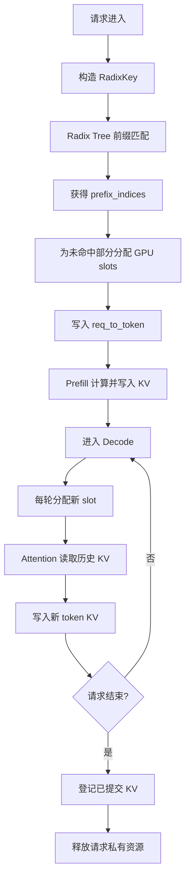
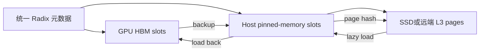

# SGLang 0.5.18 KV Cache 总览

## 1. 核心模型

理解整个系统只需区分三类对象：

| 对象 | 作用 | 主要位置 |
|---|---|---|
| KV Pool | 真正保存各层 K/V 数据 | GPU HBM、Host、L3 |
| `req_to_token` | 将请求逻辑位置映射到 GPU slot | `ReqToTokenPool` |
| Radix Tree | 将 token 前缀映射到可复用 slots | `RadixCache` / `HiRadixCache` |

```text
请求中的第 i 个 token
        ↓ req_to_token[req_id, i]
GPU slot_id
        ↓
每层 KV Pool[layer][slot_id]
        ↓
真实 K/V
```

Radix Tree 保存的是 token → slot 索引关系，不保存 K/V 张量本身。

---

## 2. 总体流程



---

## 3. 请求级状态

核心数据结构是 `Req`：

```text
origin_input_ids       原始 Prompt
output_ids             已生成 token
prefix_indices         当前命中的 GPU slots
last_node              命中前缀的最后一个 Radix 节点
req_pool_idx           req_to_token 中的请求行
kv_committed_len       已确认有效的 KV 长度
kv.kv_allocated_len    已分配的 KV 容量
```

`kv_committed_len` 用于判断哪些 KV 可以缓存；投机解码时它可能小于 `kv_allocated_len`。

---

## 4. Radix Tree

节点的关键字段：

```text
key            一段连续 token
value          对应的 GPU slot IDs
children       后继节点
parent         父节点
lock_ref       是否存在活动请求依赖该路径
last_access_time
host_value     HiCache 中对应的 Host slots
```

节点是压缩边，不是“一 token 一个节点”。

前缀查询过程：

```text
RadixKey(tokens, extra_key, cache_salt)
→ 从根节点逐段匹配
→ 必要时 split_node
→ 拼接所有命中节点的 value
→ 返回 prefix_indices 和 last_node
```

`lock_ref` 是节点级引用计数。请求依赖某个节点时，其祖先路径一起保护，不能被驱逐。

---

## 5. GPU KV 分配

`ReqToTokenPool` 保存二维索引表：

```text
req_to_token[request_slot, token_position] = kv_slot
```

`TokenToKVPoolAllocator` 管理空闲 GPU slots。

`page_size = 1` 时，每个 slot 独立分配。

`page_size > 1` 时：

```text
page_id = allocator 分配
slot_id = page_id × page_size + offset
```

页 ID 来自预先建立的空闲页集合，会循环复用，并非持续自增。

上层仍按 token slot 使用；页的归属、对齐和释放由 allocator 管理。

---

## 6. Prefill

Prefill admission 会提前知道未命中的 token 数量，因此能够预分配 slots：

```text
完整输入
→ Radix 命中 prefix_len
→ extend_len = input_len - prefix_len
→ 为 extend_len 分配 slots
→ 写入 req_to_token
→ 模型逐层计算 K/V
→ 写入对应层的 GPU KV Pool
```

容量检查采用两阶段方式：

```text
第一次检查可用容量
→ 临时保护命中前缀
→ 再次检查真实可用容量
→ 接纳或拒绝
```

第二次检查用于计入“命中前缀被锁定后不再可驱逐”造成的容量变化。

---

## 7. Chunked Prefill

长 Prompt 被拆成多个 chunk：

```text
Prompt = chunk1 + chunk2 + chunk3
          ↓        ↓        ↓
        Prefill  Prefill  Prefill
```

中间 chunk 完成后调用 `cache_unfinished_req()`，保存已经计算的前缀。

每个 chunk 可能在 Radix Tree 中产生新的后继节点；普通 `RadixCache` 没有通用的节点合并压缩过程。

Chunked Prefill 可以和 Decode 混合调度，避免长 Prompt 长时间阻塞已有生成请求。

---

## 8. Paged Cache 的页尾

共享缓存只登记完整页面：

```text
完整页 → 可放入 Radix Tree
未满尾页 → 请求私有，暂不共享
```

未完成请求会继续持有尾页，后续 token 可以填满它。

请求最终结束时，无法形成完整共享页的尾部会被释放；Radix Tree 只保留对齐部分。

---

## 9. Attention 读取

Attention backend 负责组织算子，而不是管理 Radix Tree。

执行前，上层已经生成：

```text
kv_indices    当前 batch 所有请求的历史 slot IDs
kv_indptr     每个请求在 kv_indices 中的起止位置
```

Kernel 根据 slot ID 计算页面及偏移，然后直接读取 HBM 中的 K/V。

Backend 可以是 Triton、FlashInfer、FA3、TensorRT-LLM、AITer 等；实际默认值依硬件和配置选择。

---

## 10. Decode

普通 Decode 每轮每请求处理一个新 token：

```text
检查容量
→ 分配一个 slot
→ 更新 req_to_token
→ Attention 读取历史 KV
→ 写入当前 token KV
→ 采样下一个 token
→ 在迭代边界更新请求列表
```

连续批处理发生在迭代边界：完成请求离开，新请求进入，下一轮重新构建 batch。

---

## 11. 请求结束与缓存登记

请求结束时：

```text
已确认 KV → cache_finished_req()
重复命中的 slots → 释放
页对齐的新增前缀 → 插入 Radix Tree
未提交或过量分配部分 → 释放
req_to_token 请求行 → 释放
```

Radix 节点仍可持有 GPU slots，但 `lock_ref` 降为零后可以被驱逐。

---

## 12. 驱逐、回撤与抢占

三者含义不同：

| 行为 | 操作对象 | 后果 |
|---|---|---|
| Radix 驱逐 | 无活动引用的缓存节点 | 删除缓存并释放 slots |
| Decode 回撤 | 活动请求 | 暂停请求并释放私有 KV |
| 优先级抢占 | 低优先级活动请求 | 给高优先级请求腾空间 |

普通回撤不把私有 Decode KV 插树；请求重新入队后再次查前缀，未命中部分重新 Prefill。

默认优先保留已生成 token 较多的请求；同等进度下优先保留 Prompt 较短的请求。

---

## 13. HiCache

启用 HiCache 后，工厂直接创建 `HiRadixCache`，不会同时维护两棵树。



同一个节点使用 `value` 表示 GPU 副本，使用 `host_value` 表示 Host 副本。

Host KV 不能被 Attention 直接读取，必须先复制回 GPU。

L3 以完整 page 为单位，使用链式 SHA-256：

```text
hash[i] = SHA256(hash[i-1] || page_tokens[i])
```

查询与真实读取之间允许发生驱逐竞争；读取失败时只接纳连续成功部分，其余重新 Prefill。

---

## 14. PD 分离

典型文本请求先到 Prefill 节点，再到 Decode 节点：

```text
Decode 提前分配目标 slots
→ 报告本地已有 prefix_len
→ Prefill 只发送缺少的 KV
→ Decode 各 rank 轮询传输状态
→ TP / CP / PP 达成一致
→ 请求进入 Decode batch
```

传输层可以替换为 Mooncake、MORI、NIXL 等，但调度器仍需理解并行拓扑和提交状态。

---

## 15. KV 量化

KV 量化只改变 KV Pool 的存储格式：

```text
BF16 / FP16
FP8 E4M3 / E5M2
MXFP8
NVFP4 / FP4
```

模型的全部缓存层和头使用兼容的统一格式，并同时保存必要的 scale。

Prefill 和 Decode 写入同一个量化 KV Pool；Attention backend 负责原生读取或先反量化。

跨 Host、L3 或 PD 传输时，KV 数据和 scale 必须一起移动。

---

## 16. 故障边界

```text
用户取消 / 请求超时
→ 标记 FINISH_ABORT
→ 等当前安全边界
→ 释放或缓存已确认 KV
```

飞行中的 Chunked Prefill 不会立即拆除，必须等待已发出的 GPU 工作返回，再以 `is_insert=False` 清理。

CUDA、NCCL 或某个 rank 的致命错误属于进程级故障。系统无法证明各 rank 的 KV 一致性，因此终止调度进程；HBM KV 随进程消失，已持久化的 L3 KV 可以在重启后重新查询。