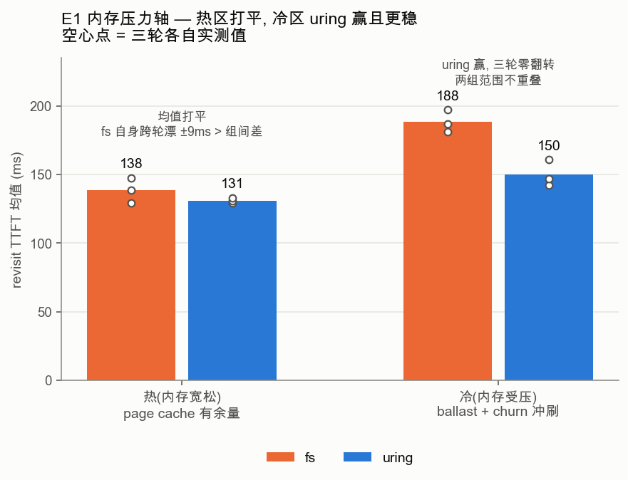
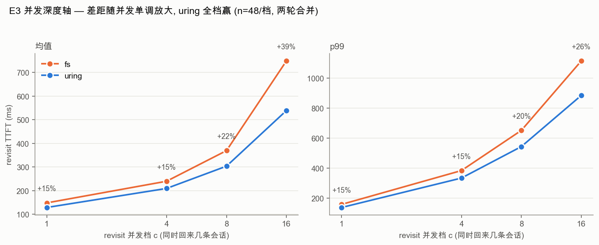
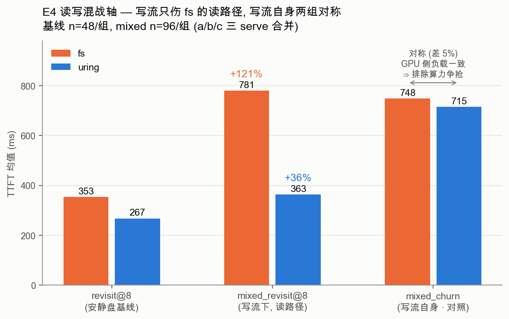
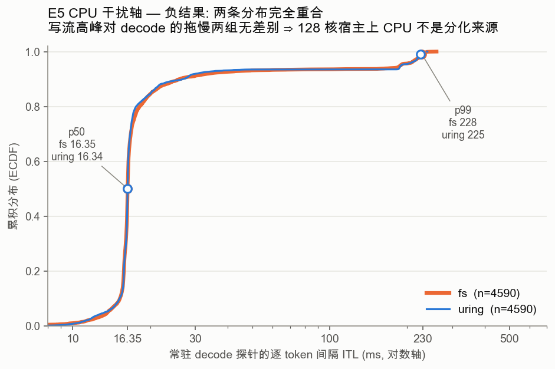

# fs vs uring tier 结论矩阵

这份文档是 `COMPARE_PLAN.md` 第 3 步点名的最终产出:一张结论矩阵,行是 IO 流的自由度轴,列是 fs 赢 / 打平 / uring 赢的条件区间,配逐轴机理。完整的实验设计、核验过程、悬案闭环记在 COMPARE_PLAN.md;主指标为什么是 TTFT 记在 METRICS.md;元数据路径的可证伪微基准记在 BENCH_ANALYSIS.md §14。这里只收结论。

## 一句话

真实 KV serving 负载穿过 secondary tier 接口后,落在"深并发 load + 持续写流混战"这个坐标(E6 dry-run 标定:Mooncake toolagent 读/写 1.93、并发 p99 27——**标的是到达过程,上机回放那半边作废,见 E6 节**),而这正是 uring tier 优势最大、fs 系统性劣化的区间。fs 的官方实现(O_DIRECT + 32 线程池 + 每 block 一文件)在浅并发、纯读、内存宽松时和 uring 打平,但每往真实负载走一步——并发变深、写流持续——它就沿着"每文件元数据路径"这一条轴系统性掉队。

## 前提与边界(读矩阵前必须知道的四件事)

**方法论:枚举的是 IO 流的自由度,不是业务场景。** 上游 prompt 千变万化,但穿过 `SecondaryTierManager` 接口后全被投影成 block 粒度的读写流,自由度只剩五个——读写比、并发深度、工作集大小、复用局部性、持续时长。两个业务场景只要投影出的 IO 流一样,对 tier 就是同一个实验。所以逐轴单变量激活这五个自由度,再用一条真实 trace 标定真实世界落在哪个坐标。

**第 0 步读源码证伪了一半先验。** 原以为 fs 走 buffered IO(吃 page cache)、多一次内核 memcpy、同步 syscall 一次只在飞一个 IO。读 vLLM 0.24 源码后前两条半作废:fs 实为 **O_DIRECT**(读写都绕 page cache)、**16 读 + 16 写线程池**、**每 block 一个文件**。page cache 轴和 memcpy 轴当场消失,剩下的真分化轴只有两条:(a) 文件布局——每 block 一次 open/O_DIRECT/close + store 侧 tmp+rename 元数据事务,对阵单 slab 纯 offset 寻址;(b) 并发模型——32 条用户态阻塞线程对阵单提交线程 + io-wq。矩阵里所有分化都只在这两条轴上。

**环境:md RAID1 把 uring 钉在 qd≈8。** 本宿主的 md RAID 触发 io_uring punt,uring 的设备并发退化为 ~8 个 io-wq 内核 worker(E1 实测均值 7)。这是 uring 成绩的**下界**——5.17+ 内核上 punt 消失,qd 不封顶,uring 只会更好。fs 那边跑的是它的正常状态(线程池与 punt 无关)。

**主指标 TTFT。** 磁盘 tier 只在 prefill 前把前缀 KV 捞回来,这次搬运完整落在 TTFT 里;decode 读的 KV 必然全在显存,tier 差异在 ITL 上天然盲。推导见 METRICS.md。

## 结论矩阵

| 轴(IO 流自由度) | 实验 | fs 赢 | 打平 | uring 赢 | 主导机理 |
|---|---|---|---|---|---|
| 工作集 vs 内存压力 | E1 | 无 | 内存宽松(热):均值打平 | 内存受压(冷):uring 赢;且全程 uring 对环境扰动更稳 | fs 15574 个小文件的元数据面暴露在邻居 IO / dentry / 内存压力下;uring 单 slab 无此作用面 |
| 并发 load 深度 | E3 | 无 | 无 | **全档赢,差距随并发放大**(均值 +13%→+39%,p99 +17%→+22%) | fs 每文件 open/close 偷设备队列深度 + 冷 dentry 8×4KiB 元数据读碎掉 IO 尺寸;uring 即便被 punt 钉在 qd≈8 仍全档赢 |
| 读写混合(持续写流) | E4 | 无 | 无 | **fs 读路径劣化 +117%,uring 零劣化(−9%)** | store 在 fs 软件流水线(线程池积压外溢 / 日志事务堆积)饿死读路径,设备实际空转(aqu<2);uring 读写同 ring 设备层公平排队 |
| CPU 干扰面 | E5 | — | **打平(负结果)** | — | 128 核宿主淹掉 CPU 轴;两 tier ITL p50 全 16.34~16.37ms。更小宿主上此轴或重现(推测,未测) |
| 复用局部性 | E7 | (不跑) | — | — | 磁盘层自我衰减:高局部性 block 被 CPU/GPU tier 留住,沉不到盘;磁盘只见低局部性冷尾,E1 冷条件已覆盖真实区间 |
| 真实 trace 标定 | E6 | — | — | — | 标定用,非新轴。**上机回放作废**(盘 load 未激活,读 0~0.5GB 对写 27.7GB),TTFT 不进矩阵;成立的是 dry-run 标定:真实**到达过程**并发 p99 27,落在 E3 的 c=8~16 区间 |

矩阵读法:从左上走到左下 = 从"实验室最干净、最有利于对手"走到"越来越像真实 serving"。fs 只在最上面两行(浅并发 / 内存宽松)守得住打平,每下一行都系统性掉队,而下面的行才是生产区间。没有任何一行 fs 赢——第 0 步证伪 page cache 轴后,原本预期"热 page cache + 低并发 fs 赢"的格子也塌了。

## 逐轴机理与关键数字

四张图由 `bench/plot_results.py` 从本地 `group_*.json` 现算重绘(E1 除外,见下),配色取 dataviz 参考调色板固定槽位并过 CVD 校验。

**E1 工作集 vs 内存压力(冻结,三轮)。** 热条件(内存宽松)均值打平:单轮 uring 领先 11% 没能跨 serve 复现,fs_hot 三轮在 129~148ms 漂(±9ms,大于均值差),uring_hot 三轮 131±2ms 纹丝不动——所以判平,并立下纪律:跨 serve 差异 < 15~20ms(共享 md0 的邻居噪声底)不下结论。冷条件(ballast 压内存)uring 三连胜零翻转:fs 181/197/187ms 对 uring 142/147/161ms,p99 差更大。两条定论:热区均值打平但 uring 对环境扰动显著更稳(15574 个小文件的元数据面暴露在邻居状态下,单 slab 无作用面);内存压力叠加 churn 冲刷下 fs 因元数据路径系统性劣化,uring 近乎免疫。(修正:制造元数据缓存失效的主因是 churn 几万个新文件冲刷,不是 ballast 内存压力——ballast 只覆盖数据缓存,够不着几 MB 的元数据。详见 BENCH_ANALYSIS §14。)

(图注:空心点是三轮各自的实测均值。热区两组的点范围互相淹没——fs 自身跨轮漂 ±9ms 已大于组间差,所以判平;冷区两组点范围完全不重叠,三轮零翻转。E1 只有第一轮的原始 JSON 在本地,图中另两轮取 COMPARE_PLAN §143 的冻结记录,脚本 `e1_data()` 里注明。)

**E3 并发 load 深度(冻结,两轮独立 serve + t_wall×iostat 核验)。** 主战场。差距随并发放大:均值优势 c=1 的 +8~13% 单调涨到 c=16 的 +26~39%(fs 753/749ms 对 uring 559/539ms,p99 1151/1117 对 912/912)。fs 在 c=16 的 revisit/prime 比值两轮都是 1.11——从盘拉回比串行重算还慢;uring 同档保住 0.84/0.81。归因经核验收敛:两边都没打到设备上限(1089MB/s 是 5.32GB 突发摊在 5s 采样里的假封顶,md 双镜像真实瞬时可到 3.5GB/s),分化是**带宽提取能力**——有效带宽 uring 随 c 爬到 ~3.5GB/s,fs 在 ~2.5GB/s 出平台。三路旁证自洽:aqu-sz uring 钉在 ~8(= io-wq worker 数,punt 下界),fs c=16 掉到 4~6(线程时间被 open/close 吃掉);设备请求尺寸 uring 342~500KB 对 fs 135~250KB(冷 dentry 每次 open 掺 8 次 4KiB 元数据读稀释均值);pidstat 上 fs 的 EngineCore 系线程更热。这条归因已由 2026-07-14 元数据微基准做成可证伪实验:同盘同数据量、唯一变量是文件布局,元数据缓存失效后设备平均请求尺寸 773→88.5KiB、请求数 7.4×、数据吞吐 −29%,而"单文件每次重开"的对照组纹丝不动——贵的不是 `open()` 本身,是那一万五千条 dentry(BENCH_ANALYSIS §14)。

**E4 读写混合(冻结,第二次干净对照 + 三条核验闭环)。** 最接近真实稳态。decode 相位口径(剥掉撞 GPU prefill 排队的批,得纯读路径):持续写流下 fs 读路径 **+117%**(766ms,p99 1634,revisit/prime 1.04~1.25,从盘拉回已不比全量重算快),uring **−9% 零劣化**(244ms,噪声内)。fs 劣化**逐波累积**(wave1 尾批还在基线水平 271~329ms,wave2 才崩到 823~1385ms),uring 逐波持平。iostat 画面是决定性的:同样 5.4GB 一波,uring 全程 2~3s 读完,fs 从基线 2s 拉长到 wave1 3s、wave2 4~5s,中途读速掉到 400MB/s 甚至断流**而 aqu<2**——设备闲着,是 fs 自己的软件流水线断了,不是设备带宽被读写平分。机理定到"store 在 fs 软件层饿死读路径",两条候选(DualQueueThreadPool 读写互为 fallback 的积压外溢 / 每 block tmp+rename 日志事务堆积)本轮数据分不开,如实记为待分辨项——要分开需再设计一个把 rename 换成 O_DIRECT 原地写的对照。干扰源对称:两边 mixed_churn TTFT 711~763ms 几乎相同,证明 GPU 侧负载一致,分化确在读路径。

(图注:第三组 `mixed_churn` 是**对照**,不是成绩。churn 请求负责制造写流,它的 TTFT 由 GPU prefill 主导、几乎不碰 tier 读路径。"store 偷公摊 CPU 拖慢整个引擎"这种机制是**非选择性**的——CPU 是全机公摊,抽干了谁都遭殃,连不读盘的 churn 也会跟着慢。实测 churn 两组只差 5%(748 vs 715),证明 GPU 侧负载一致,这条退路被堵死;而同一批 serve 里读路径劈叉到 781 vs 363。一个共享量对称、一个读路径量劈叉,差距就被干净地锁死在读路径上。图中 mixed 是全量口径;剥掉撞 churn prefill 排队的批之后的 decode 相位纯读路径口径是 fs +117%、uring −9%。)

**E5 CPU 干扰面(冻结,负结果)。** 两条证据源全负。直接量(pidstat -t):进程级 fs 多烧 +10%(c=1)到 +35%(c=16),但绝对量是 128 核上多 ~0.1 个核,线程级形态两组一致(引擎主循环 92~97%、其余全 <8%,无线程饿着)——记账差异,非瓶颈。端到端探针(常驻 decode ITL):六组 p50 全部 16.34~16.37ms,均值 fs 29.65~30.07 对 uring 29.91~30.63ms,p99 全 227~230ms,IO 高峰对两组 decode 拖慢幅度无差别。结论:这个负载下 CPU 不是分化来源,分化全部来自 IO 路径本身。诚实边界:128 核宿主淹掉了 CPU 轴,更小宿主(8~16 核推理机,fs 32 条池线程占比陡增)上此轴可能重现,但那超出本轮实测,只写成推测。

**E7 复用局部性(不跑,论证代替实验)。** 五个自由度里唯一没对应实验的轴。不跑的理由是它在磁盘层自我衰减:高局部性 = 同一批 block 被反复访问,而被反复访问的 block 恰恰被 GPU/CPU tier 留住,根本沉不到盘;真正落到磁盘 tier 的读天然是被上层筛剩的低局部性冷尾。所以磁盘层的局部性区间本就很窄,E1 冷条件(每会话独有前缀、逐出后回访)已落在这个真实区间。若结论被挑战,固定工作集扫前缀池配比 P×F 的设计随时可启用(见 COMPARE_PLAN E7)。

**E6 真实 trace 标定(冻结;dry-run 标定成立,上机回放作废——负结果)。** 回放 Mooncake 生产 trace(toolagent 前 150 条)。这一跑分两层交付,一层成立、一层作废,分开记。

**成立的一层:dry-run 标定。** toolagent 全 trace(23608 条,过滤 input_length>16384 后)读/写 1.93、并发估计 p99 27;conversation(12031 条)读/写 0.57、并发 p99 13。真实负载的**到达过程**稳落在 E3 的 c=8~16 区间。这层是 trace 分析,不依赖上机,不受下面的作废影响。

**作废的一层:上机回放(2026-07-17 t_wall×iostat 核验)。** 四档 × 两 tier × a/b 共 16 组**全部不通过作废条件**:回放窗口内 md0 读量按档为 0.00 / 0.00 / 0.01 / 0.46~0.53 GB,而同期写 27.7GB——**磁盘 tier 的 load 路径几乎没被激活,这一跑是纯 store 主导的负载**。TTFT 的组间差异因此不能归给 tier 读路径:c=16 的 fs 2284 对 uring 2073ms 看着像 uring 赢 9%,但那一档全窗口只读了 0.46GB、占 2 秒,这点 IO 撑不起 200ms;c=8 更直接翻向(fs 947 对 uring 950,打平),方向都不自洽。这两个数只能记作"未激活读路径时的观测",不进结论矩阵。

对齐本身经双账印证,排除了记账错误:(a) 写侧窗口积分 27.7GB 精确等于收尾哨兵报的 `kv_fs 落盘 27.5GiB`,窗口没切偏;(b) vLLM 自己的 `kv_offload_load_bytes` 独立佐证同一结论——c=1 是**精确的 0 字节**(整轮一次 tier 都没打),c=16 也只有 0.72~0.92GB,与 md0 读的 0.46~0.60GB 同量级(前者是 CPU primary + 磁盘 secondary 的合账,本就该 ≥ 盘读,差值即命中 CPU tier、不落盘的那部分)。两本账、两个观测点、同一个结论。

**为什么打不到盘:根因在 vLLM 的 lookup 起点,不是模糊的"截留"。** 读源码定位到一句话根因:**tier 的 lookup 起点被钉在 GPU prefix cache 的命中边界上,而这个窗口 GPU 吃掉了全部共享前缀,边界之后永远是没算过的新块,于是每次 lookup 第一个 key 就 MISS、`submit_load` 一次没被调用过。** 链路(vLLM main,`offloading/scheduler.py`):`start_block_idx = num_computed_tokens // offloaded_block_size`(`num_computed_tokens` = GPU 命中数),再从那里对 tier 做 `_maximal_prefix_lookup`("往后数连续命中,第一个 MISS 就 break")。Mooncake 的复用是"共享前缀 + 独有新后缀",GPU 命中全部共享前缀后,tier 扫描起点正好落在新后缀第一个 block——从没算过、必然 MISS。二级命中还有第二道闸:返回 `RETRY` 要先 promotion 回 CPU primary,CPU tier 满时直接判 MISS 重算(CPU tier 仅 4681 block,c=16 的在飞就撑爆)。可证伪点是 **LRU 栈距离**:一次复用能否走到 tier,取决于它的栈距离是否 > GPU 容量(223 block = 114240 token)。`--dry-run` 实测把它钉死——**E6 那 150 条窗口的复用距离 919/919 = 100% 落在容量内,连 max(180 block) 都够不着容量线,预测 tier 零激活,与 c=1 实测 load_bytes 精确 0、md0 读 0.00GB 三本账严丝合缝。** 旁证自洽:`External prefix cache hit rate`(统计的是 offload tier 整体、含 CPU tier)全程 0~3.3%,连 CPU tier 都基本没命中;c=16 设备请求尺寸 fs 446.8KB ≈ uring 441.6KB(文件几十秒前刚写、dentry 全热,**E3/E4 里 fs 的冷 dentry 劣化源在这个窗口不存在**)。

**结构性负结果:两条窗口判据反向,单节点无可行解。** 这不是"这次没测到",是这个尺度**测不了**,而且能定量说死。盘 36 GiB ÷ 28 MiB/block ≈ 1300 block 把窗口锁死在约 200 条请求(E6 的 150 条已用 1009 block / 27.6G);而 trace 开头这个尺度的窗口只跨 33 秒、会话还没铺开、复用全是紧邻的(p50 栈距离 23 block)。要复用距离够长(超容量占比 >5% 才标定得了 load 路径)就得拉长窗口,窗口一长盘上界同比涨——全 trace 上界 2350 GiB。**装得下 ⟺ 复用够不着 tier;够得着 ⟺ 装不下。两约束反向,中间无解。** 对照能看清 tier 不是没用:整条 trace(过滤后 21167 条)有 **17.9%** 的复用距离超出 GPU 容量、p90 达 3011 block——真实负载里 tier 确实有活干,只是不在装得下的那一段。方法论教训:E6 当年选窗口只看了"盘装得下 + 读写比均衡",漏掉决定 tier 死活的第三个量(复用距离),结果 16 组跑完一整夜、核验才发现测量对象从一开始就不在。现已把复用距离做成 `--dry-run` 的硬判据(mooncake_replay 的"窗口判据汇总"),下次选窗口先过这道闸。dry-run 的到达过程标定(并发 p99 27)不碰这一层,继续成立。(改负载缩 GPU/CPU cache 能强行激活 tier,但那已不是真实 trace 的自然落点,标定意义归零。)

## 已知不对称与诚实边界

**容量与写放大(已销案)。** E3 观察到 uring 全程写 101G 对 fs 35G(2.9× 写放大),根源是 `disk_bytes_to_use=20G` < 盘上工作集 ~35G,前缀被 revisit 拉回后反复逐出重写。E4 把容量做到工作集以内(零逐出)后证伪并闭环:uring 全程 md0 写 22.4G ≈ 自身唯一块 22.36G,与 fs 对称,manager 无 bug。E3 结论方向因此成立且当时偏保守(uring 是背着自身逐出写赢下 TTFT 的)。

**fs 无容量上限。** fs tier 连容量配置项都没有,按文件名天然去重、每块写一次;13 轮 churn 累积 40462 文件 / 34.6GiB,距盘满余 0.7G。这是运维层面的独立对比点,也是 E4 设计 churn 总量的硬约束。

**fs 吸收率之谜(未闭合,不阻塞结论)。** E3 的 churn 每条只 23% 的 KV 落盘,E4 是 75~81%,请求节奏几乎相同。第二次 e4 排除了"文件数到 2.6 万拖垮 store"(90s 持续写 ~340MB/s 无衰减、store 零失败),但 E3 条件(4 万文件、30+ 分钟、churn 与并发 load 交错)未复现,两个候选(随文件数/时长衰减、静默丢块)仍开放。不影响任何冻结结论(相关轮两 tier 落盘对称)。

**主指标口径。** E1~E4 是判别性实验,刻意不用合成指标(goodput 会抹掉机制信息);E6 若升级生产评测口径可按 goodput 报一版。判据三层结构(端到端主指标 / 机制归因指标 / 有效性哨兵)见 METRICS.md。
