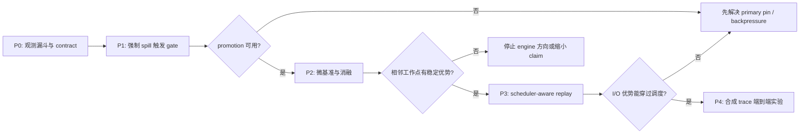

# vLLM 0.24.0 Second-tier 实验研究

本目录用于回答一个具体问题：

> 在明确限定为“已经会使用 second tier 的 workload”后，`uring-slab`
> 相对 vLLM 0.24.0 原生 FS tier 是否能降低 revisit TTFT、提高 SLO
> goodput，优势来自哪里，以及上层调度是否会吞掉纯 I/O 优势。

## 先给结论

1. **不建议在“second tier 在真实业务里是否常见”上投入大量实验。**
   如果最终 claim 是“在会深度复用、且 KV 已被挤出 GPU/CPU 的场景中，
   uring-slab 是更好的 secondary backend”，那么只需要一个很小的触发验证，
   不需要证明这个场景在所有真实业务里普遍存在。
2. **必须做一个最小的上层可用性 gate。** 原因不是为了证明真实 workload，
   而是 vLLM 的 CPU primary 可能因为 store/cascade/load 的 pin 被占满。
   这时即使 FS 命中，promotion 也会被当作 miss，纯 I/O 优势无法进入 TTFT。
3. **微基准必须分两层。**
   - 数据面基准：拆出 file-per-block、Python/线程池、slab、io_uring
     各自的贡献。
   - 完整 tier-contract 基准：直接使用 vLLM 0.24.0 的
     `FileSystemTierManager`，走 `lookup/submit/get_finished` 生命周期。
4. **端到端主指标建议定为 SLO goodput，revisit TTFT 作为第二主指标。**
   原因是 second tier 的价值是用存储资源换 GPU prefill 计算；单用户 TTFT
   能说明机制是否成立，而固定 TTFT/ITL SLO 下可服务的请求率更接近系统价值。
5. **当前采用两周快线，从核心因果链向外扩展。**
   先完成 adapter、contract、正式微基准与最小端到端 A/B，再整理作品；
   若负结果成立则转为瓶颈定位与适用边界，不通过修改 trace 追求正结果。

## 文档入口

- [vLLM 0.24.0 源码事实与接口](docs/VLLM_024_ARCHITECTURE.md)
- [实验路线、矩阵、指标与时间线](docs/EXPERIMENT_ROADMAP.md)
- [两周快线：先完成研究，再整理成作品](docs/TWO_WEEK_EXECUTION_PLAN.md)
- [代码、配置、运行结果管理方案](docs/CODE_MANAGEMENT.md)
- [当前云 GPU 环境资格审计](ENV_REPORT.md)
- [vLLM/native-FS/uring prototype 运行证据索引](evidence/runtime/20260725T103442Z/INDEX.md)
- [锁定的上游版本](SOURCE_LOCK.json)

## 当前可执行状态

截至 2026-07-25：

- 干净 venv
  `/root/uring-slab-experiments/venvs/vllm024-cu129-clean` 中，官方
  `vllm==0.24.0+cu129`、Torch `2.11.0+cu129` 与锁定 source commit
  已通过 CUDA、tiering imports 和真实小模型 generation；
- 原生 FS 已完成
  `store → 持久化 → 服务重启 → external hit → promotion/load` 闭环，
  400 tokens 与 4,915,200 bytes 在文件、进程 I/O 和 vLLM metrics 三侧
  对账一致；
- 选择性移植的 uring-slab prototype 已通过 64 MiB O_DIRECT 全区 SHA-256；
- 旧实验数据与本次 256 MiB 短诊断均不作为正式结果。

下一项实现工作是独立 `UringSecondaryTierManager` adapter、共享 contract
suite 与统一 instrumentation；在它们通过前不启动正式性能矩阵。

## 静态环境采集

`scripts/collect_static_env.sh` 只读取并输出操作系统、CPU/NUMA、内存、
cgroup、GPU/CUDA、文件系统、块设备队列、io_uring 和工具链信息。脚本自身
不创建文件、不安装软件、不运行 I/O 负载，也不修改任何系统参数。

直接查看：

```bash
./scripts/collect_static_env.sh
```

需要保存为实验材料时，由调用者显式指定输出文件：

```bash
./scripts/collect_static_env.sh |
    tee static-env-$(date -u +%Y%m%dT%H%M%SZ).txt
```

## 建议的研究 claim

推荐先注册一个范围清楚的条件式 claim：

> 对于 prefix KV 的 reuse distance 已超过 GPU 与 CPU primary 容量、
> promotion 能够获得 CPU staging slot、并且 secondary I/O 位于请求关键路径
> 的 workload，预分配 slab + io_uring 的 secondary tier 相对 vLLM 0.24.0
> file-per-block FS tier，能够以更低的 tier job tail latency 和 CPU/GiB
> 提高 revisit TTFT 或 SLO goodput。

这条 claim **不声称**：

- 所有生产 workload 都频繁使用 second tier；
- 所有模型、文件系统和内核上 io_uring 都更快；
- 单纯提升块设备带宽必然等比例提升端到端 TTFT；
- slab 的容量、恢复和运维语义与 FS 的持久文件语义完全等价。

## 总体流程



P0/P1 是低成本 gate；P2 是核心机制实验；P3 用无 GPU 或最少 GPU 的方式
验证上层影响；只有前三者都通过，才进入昂贵的 P4。
