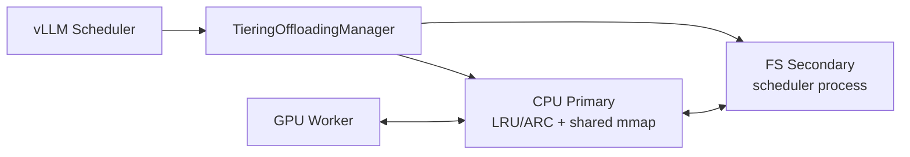
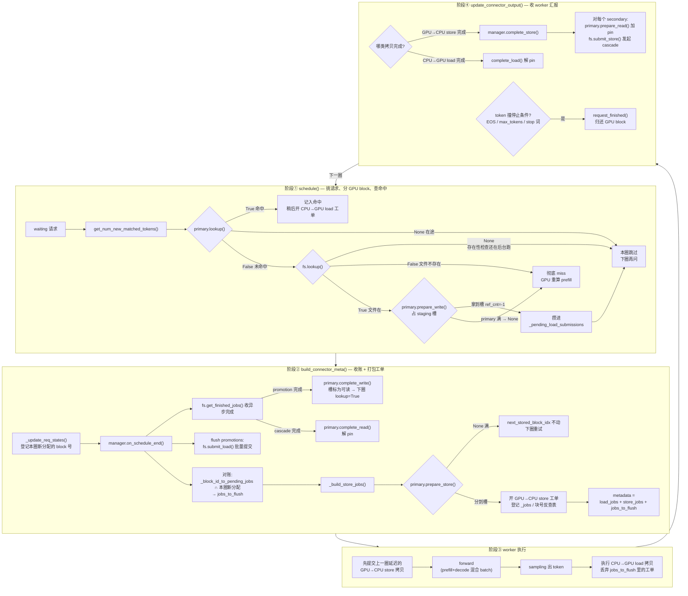
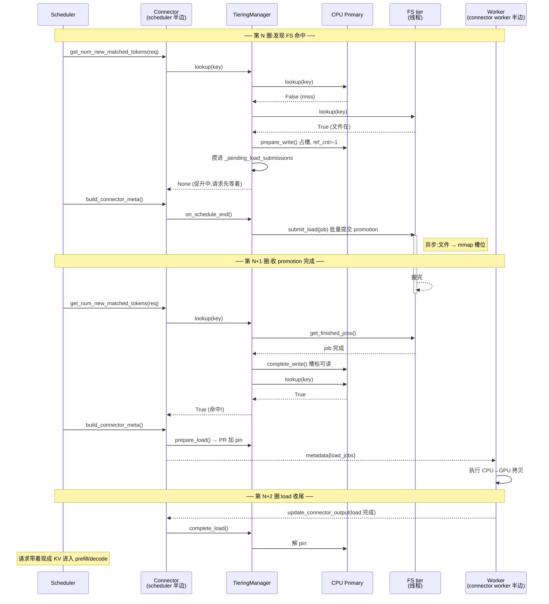

# vLLM 0.24.0 FS tier：源码事实与接口

## 1. 源码范围与版本

本文只描述 vLLM `v0.24.0` tag，对应 commit
`ee0da84ab9e04ac7610e28580af62c365e898389`。不要把 main/latest 的行为
自动外推到本实验。

关键上游入口：

- [KV Offloading 配置文档](https://docs.vllm.ai/en/v0.24.0/features/kv_offloading_usage/)
- [Offloading scheduler](https://github.com/vllm-project/vllm/blob/v0.24.0/vllm/distributed/kv_transfer/kv_connector/v1/offloading/scheduler.py)
- [Offloading worker](https://github.com/vllm-project/vllm/blob/v0.24.0/vllm/distributed/kv_transfer/kv_connector/v1/offloading/worker.py)
- [Tiering manager](https://github.com/vllm-project/vllm/blob/v0.24.0/vllm/v1/kv_offload/tiering/manager.py)
- [SecondaryTierManager 接口](https://github.com/vllm-project/vllm/blob/v0.24.0/vllm/v1/kv_offload/tiering/base.py)
- [FS manager](https://github.com/vllm-project/vllm/blob/v0.24.0/vllm/v1/kv_offload/tiering/fs/manager.py)
- [FS I/O](https://github.com/vllm-project/vllm/blob/v0.24.0/vllm/v1/kv_offload/tiering/fs/io.py)
- [FS 双队列线程池](https://github.com/vllm-project/vllm/blob/v0.24.0/vllm/v1/kv_offload/tiering/fs/thread_pool.py)
- [CPU primary manager](https://github.com/vllm-project/vllm/blob/v0.24.0/vllm/v1/kv_offload/cpu/manager.py)
- [Spec factory](https://github.com/vllm-project/vllm/blob/v0.24.0/vllm/v1/kv_offload/factory.py)

## 2. 总体架构

`OffloadingConnector` 分 scheduler side 与 worker side：

- scheduler side 决定哪些 block 命中、需要 load/store，维护 CPU/secondary
  的元数据与 ref count；
- worker side 执行 GPU↔CPU 的实际 DMA；
- secondary tier **只存在于 scheduler 进程**，通过共享 CPU memoryview
  读取或写入 primary tier；
- secondary tier 不能直接访问 GPU。



数据路径固定为：

- store：`GPU → CPU primary → 所有 secondary tiers`
- load：`secondary tier → CPU primary → GPU`

因此 uring-slab 能替换的是 `CPU↔secondary` 段，不能消除 CPU staging，
也不能绕过 GPU↔CPU 复制。

### 2.1 一个 scheduler step 的内部流程

术语约定：GPU↔CPU 段的两个方向叫 store（GPU→CPU）/load（CPU→GPU），
由 worker 执行；CPU↔FS 段的两个方向叫 cascade（CPU→FS）/promotion
（FS→CPU），由 FS 线程执行。primary 上 `prepare_write/read` 是
`prepare_store/load` 的别名（GPU 视角与 secondary 视角同一套函数）；
FS 接口的 `submit_store/submit_load` 里 store/load 则指 CPU↔FS 方向。



FS 线程始终在图外异步跑：`submit_load` 之后做文件→mmap（promotion），
`submit_store` 之后做 mmap→文件（cascade），结果都等下一圈的
`get_finished_jobs()` 才被收走。

### 2.2 FS 命中一个前缀的函数时序（跨三圈）



两张图的共同点：**所有异步都发生在圈与圈之间，圈内全是同步记账**。
FS 线程和 GPU 拷贝在背景跑，但结果只在每圈固定的收账点
（`get_finished_jobs()`、`update_connector_output()`）被承认。
这是第 9 节里 completion→observed lag 的来源，也是 4.1 节 TTFT
分解式里排队延迟项的结构性原因。

## 3. 什么时候会 store

`_build_store_jobs()` 在每个 scheduler step 的 connector metadata 构建阶段被
调用，但“每步调用”不等于“每步把所有 KV 重写一遍”。

实际规则：

1. 只检查本 step 被调度的 request；
2. 只处理从 `next_stored_block_idx` 到当前新形成的**完整 offloaded block**；
3. 已存在于 CPU primary 的 key 不重复做 GPU→CPU store；
4. `prepare_store()` 因 CPU primary 没有可逐出槽而返回 `None` 时，
   `next_stored_block_idx` 不前进，后续仍可能重试；
5. 默认 `offload_prompt_only=true`，decode 阶段 block 不进入 store；
6. 可用请求级 `max_offload_tokens` 限制只保存开头的一段；
7. GPU→CPU store 会被 worker 延迟到**下一个 engine step 开头**提交，
   目的是避开 token sampling 路径；
8. GPU→CPU 完成后，`TieringOffloadingManager.complete_store()` 才把这些
   block cascade 到**所有** secondary tiers。

所以 FS 的写入流量更接近：

```text
eligible new complete prompt blocks
  - duplicate blocks
  - requests/blocks skipped by per-request cap
  - stores temporarily rejected by CPU primary pressure
```

Tiering 模式不支持 `store_threshold >= 2`。也就是说，上游没有一个可直接
配置的“只有复用过 N 次才写 secondary”策略；减少一次性写入主要依靠
`offload_prompt_only`、`max_offload_tokens` 或自定义 tier policy。

## 4. 什么时候会读 FS

FS 读只发生在一个新 request 的 prefix-cache lookup 路径中，且要依次满足：

1. request 有可复用的完整 prefix block；
2. GPU prefix cache 没有覆盖该段；
3. CPU primary lookup miss；
4. FS 的文件存在；
5. CPU primary 能为 promotion 分配 staging slot；
6. FS→CPU load 成功；
7. 随后 CPU→GPU load 成功。

可以把“真正由 second tier 服务的 block 比例”写成漏斗：

```text
P(useful secondary load)
= P(revisit candidate)
× P(GPU miss)
× P(CPU miss | GPU miss)
× P(secondary hit)
× P(primary reservation succeeds)
× P(secondary I/O succeeds)
× P(CPU→GPU succeeds)
```

这比“revisit 请求比例”更准确。并发深度主要影响排队和
`P(primary reservation succeeds)`，并不会单独创造 FS hit。

### 4.1 FS lookup 自身也是异步的

FS 用一个后台 lookup thread 批量执行 `os.path.exists()`：

1. scheduler 第一次 lookup 得到 `None`；
2. request 本 step 被跳过；
3. step 末把 existence batch 交给后台线程；
4. 后续 step 才拿到 True/False。

FS 文件存在后，promotion 也不是立刻 load：

1. `TieringOffloadingManager` 先在 CPU primary 预留 slot；
2. 同一 step 内把多个 block 聚合；
3. `on_schedule_end()` 才调用 FS `submit_load()`；
4. FS job 完成后，manager 只在后续 scheduler poll 时把 slot 标记为 ready；
5. scheduler 再生成 CPU→GPU load job；
6. request 最终开始 prefill/decode。

因此端到端 TTFT 里至少包含：

```text
FS metadata lookup
+ scheduler step quantization
+ FS data queue/service
+ completion polling lag
+ CPU→GPU transfer
```

slab 的内存索引可以同步回答存在性，这既是完整 backend 的真实优势，也是
需要在“纯数据面基准”中单独剥离的变量。

## 5. store/load 的优先级与容量语义

### 5.1 scheduler 层

同一个 scheduler step 中：

1. waiting request 的 prefix lookup/promotion reservation 发生在调度阶段；
2. `build_connector_meta()` 先调用 manager `on_schedule_end()`，
   提交本 step 累积的 promotions；
3. 然后才 `_build_store_jobs()` 创建新的 GPU→CPU store。

所以对**本 step 新竞争的 CPU slot**，promotion 先于新 store。

但这不是全局 load 优先级。先前已经在途的 GPU→CPU store、CPU→FS
cascade、FS→CPU promotion、CPU→GPU load 都可能 pin primary block。
这些 pin 不释放时，新 promotion 仍可能拿不到 slot。

### 5.2 CPU primary 满时

CPU primary 的 block 状态：

- `ref_cnt=-1`：写入中，不 ready、不可逐出；
- `ref_cnt=0`：ready 且可逐出；
- `ref_cnt>0`：作为某个 transfer 的源被 pin，不可逐出。

`prepare_store()` 或 promotion 的 `prepare_write()` 只有在“空闲槽 +
可逐出且未保护槽”足够时才成功。

最关键的差异：

- **新 store 分配失败**：scheduler 打 warning，本次不推进 store cursor，
  活跃 request 后续可能重试；
- **FS hit 的 promotion 分配失败**：manager 直接返回 `False`，
  上层把该 block 当作 external miss，request 走 recompute，而不是一直等待。

因此，FS hit rate 不能代表 FS useful-hit rate。必须单独记录：

- secondary lookup hit；
- promotion attempted；
- promotion accepted；
- promotion rejected: primary full；
- secondary load completed；
- CPU→GPU completed。

### 5.3 FS 线程池

FS 默认：

- 16 个 read-priority threads；
- 16 个 write-priority threads；
- 两个队列：load queue 与 store queue；
- read group 优先拿 load，write group 优先拿 store；
- 自己的队列空时会帮助另一队列。

这不是“所有线程先读后写”的严格优先级，而是**有借用能力的读写分区**。
当读写队列都持续非空时，近似 16 路读 + 16 路写；单向负载时最多 32
个线程都能处理同一方向。

## 6. vLLM 0.24.0 FS tier 的真实实现

### 6.1 数据与文件布局

- 每个 offloaded block 一个 `.bin` 文件；
- hash 前缀分多级目录，避免单目录 fan-out；
- store：`O_DIRECT` 打开临时文件，单次 `os.write()`，close，
  `os.replace()` 原子替换；
- load：`O_DIRECT` 打开目标文件，单次 `os.readv()` 直接写 primary
  memoryview，close；
- 已存在文件不重复写；
- load 失败会尝试删除源文件；
- 没有 `fsync`/目录 fsync；
- 没有磁盘容量参数、磁盘 LRU 或后台回收；
- secondary reset 不删除持久文件。

因此对比轴不是“FS buffered I/O vs uring O_DIRECT”。两边都可以是
O_DIRECT。主要差异应拆成：

1. file-per-block 的 open/close/目录/rename 元数据成本；
2. Python + blocking thread pool 的调度与 CPU 成本；
3. 单文件 slab 的 offset 寻址与容量管理；
4. C++ pool 与 io_uring 批量提交的差异；
5. FS 异步 existence lookup 与 slab 内存索引的差异。

### 6.2 FS 参数

| 层级 | 参数 | 默认 | 语义 |
|---|---|---:|---|
| connector | `spec_name` | `CPUOffloadingSpec` | 多级必须设 `TieringOffloadingSpec` |
| primary | `cpu_bytes_to_use` | 必填 | 所有 workers 合计的 CPU primary 字节数 |
| primary | `block_size` | GPU block size | offloaded block token 数；必须是 GPU block size 的倍数 |
| primary | `eviction_policy` | `lru` | `lru` 或 `arc` |
| store | `offload_prompt_only` | `true` | true 时不保存 decode block |
| store | `max_offload_tokens` | 无上限 | request 的 `kv_transfer_params` 中设置 |
| tiering | `secondary_tiers` | `[]` | 按顺序配置多个 secondary tiers |
| FS | `root_dir` | 必填 | 持久块目录 |
| FS | `n_read_threads` | `16` | read-priority threads |
| FS | `n_write_threads` | `16` | write-priority threads |

原生 FS 的最小多级配置形状：

```json
{
  "kv_connector": "OffloadingConnector",
  "kv_role": "kv_both",
  "kv_connector_extra_config": {
    "spec_name": "TieringOffloadingSpec",
    "cpu_bytes_to_use": 4294967296,
    "block_size": 16,
    "eviction_policy": "lru",
    "offload_prompt_only": true,
    "secondary_tiers": [
      {
        "type": "fs",
        "root_dir": "/mnt/nvme/vllm-kv",
        "n_read_threads": 16,
        "n_write_threads": 16
      }
    ]
  }
}
```

限制与注意事项：

- `store_threshold >= 2` 在 `TieringOffloadingSpec` 中被拒绝；
- `self_describing_kv_events=true` 在 tiering 中被拒绝；
- 跨进程共享同一 `root_dir` 时要固定同一个 `PYTHONHASHSEED`；
- 并行无关的文件布局只对单个 full-attention group 等条件成立；
  MLA、V2 runner、复杂 group 布局不能默认跨 parallelism 复用；
- FS 没有 `queue_depth`、最大 pending job、磁盘容量、回收水位等参数。

## 7. 新 secondary tier 必须实现什么

### 7.1 必需接口

| 方法 | scheduler 线程要求 | uring-slab 的职责 |
|---|---|---|
| `lookup(key, ctx) -> bool \| None` | 轻量、非阻塞 | 查内存索引；在途写返回 `None` |
| `submit_store(JobMetadata)` | 轻量、非阻塞 | 去重、容量/逐出、分配 slab slot、提交异步写 |
| `submit_load(JobMetadata)` | 轻量、非阻塞 | pin slab slot、提交异步读到 primary block |
| `get_finished_jobs()` | 非阻塞 poll | 返回 `(job_id, success)`，完成后解 pin/提交元数据 |
| `on_new_request(ctx)` | 轻量 | 通常返回默认 BLOCK_LEVEL policy |
| `drain_jobs()` | 允许阻塞 | 等所有已接收 job 完成，不留下半拷贝 |

`JobMetadata` 提供：

- `job_id`；
- `keys`；
- `block_ids`：primary-tier slot ID 的 NumPy 数组；
- `is_promotion`；
- `req_context`。

框架保证：

- store 时 primary `block_ids` 在 transfer 期间已被 pin，可安全读取；
- load 时 primary `block_ids` 已分配，可安全写入。

tier 自己负责：

- secondary 内的 key→slot 索引；
- duplicate/in-flight 语义；
- secondary capacity 与 eviction；
- secondary slot 的 load pin；
- job 背压或拒绝；
- I/O 失败后的索引回滚；
- 完成通知。

### 7.2 建议实现的可选接口

- `has_pending_work()`：只要引擎或本地 completion queue 有活就返回 true；
- `touch()`：更新 slab LRU；
- `on_request_finished()`：清理 request 级 lookup/计数状态；
- `on_schedule_end()`：提交本 step 延迟批次或 flush 观测；
- `shutdown()`：drain、收割 completion、关闭 ring/fd、落统计。

`has_pending_work()` 很重要：如果 engine 已无普通 request、但 secondary job
仍在飞，返回 false 可能使 scheduler 不再 step/poll，完成事件饿死。

### 7.3 失败语义

KV 可以重算，所以 secondary tier 的合法兜底是“逐出或拒绝”：

- store 容量不足且无可逐出 slot：该 job 返回失败；
- load I/O 失败：该 job 返回失败，并把可疑 key 从索引删除；
- queue/ring 满：要么在 manager 内有界排队，要么整 job 失败并完整回滚；
- 不允许 job 部分成功却把全部 key 标记 present；
- `drain_jobs()` 不能中断正在写 primary memoryview 的半次传输。

## 8. 如何接入而不 fork vLLM

vLLM 0.24.0 的 `SecondaryTierFactory` 只内置 `example/fs/obj`，没有直接的
`module_path` tier 配置。不过 `OffloadingSpecFactory` 支持
`spec_module_path` 动态加载自定义 spec。

推荐实验接法：

1. 在独立 Python 包中定义 `UringTieringOffloadingSpec`，继承
   `TieringOffloadingSpec`；
2. 模块 import 时向 `SecondaryTierFactory` 注册 `uring_slab`；
3. 配置：

```json
{
  "spec_name": "UringTieringOffloadingSpec",
  "spec_module_path": "vllm_second_tier_lab.spec",
  "cpu_bytes_to_use": 4294967296,
  "secondary_tiers": [
    {
      "type": "uring_slab",
      "path": "/mnt/nvme/kv.slab",
      "disk_bytes_to_use": 34359738368,
      "queue_depth": 32
    }
  ]
}
```

这样能保持 vLLM source tree 干净。只有准备 upstream 时，才把一行正式注册
加入 vLLM factory。

## 9. 需要专门验证的上游影响

这些不是 uring engine 的纯 I/O 问题，却可能决定端到端结果：

1. CPU primary 因 cascade/load pin 饱和，导致 promotion 被降级成 recompute；
2. FS 的异步 existence lookup 多消耗一个或多个 scheduler step；
3. secondary 完成只在 scheduler step poll，存在 completion→observed lag；
4. background store 与 revisit load 同时占 FS 线程、设备与 primary slot；
5. store cursor 在 CPU 满时会重试，但 request 结束附近的尾块可能没有后续
   schedule 机会；
6. FS 无容量上限，长实验可能先耗尽空间或 inode；
7. `block_size` 同时改变 I/O 粒度、文件数、lookup 粒度和可复用粒度，
   不能只按吞吐解释；
8. 多 secondary tier 会对每个 tier 各 pin 一次 primary block；
9. shutdown/reset 要先 drain secondary，否则 primary mmap slot 复用会与
   仍在途 I/O 竞争。

实验中必须把这些因素与 engine 数据面分开记录。
